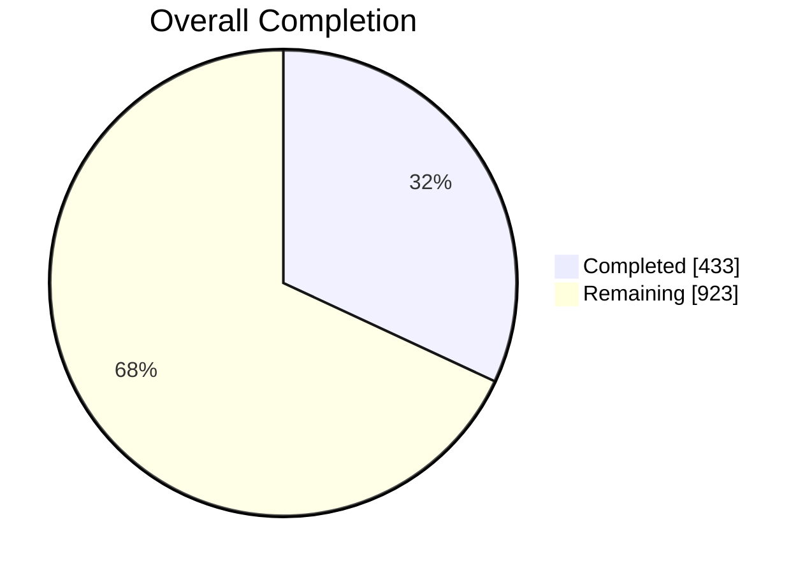
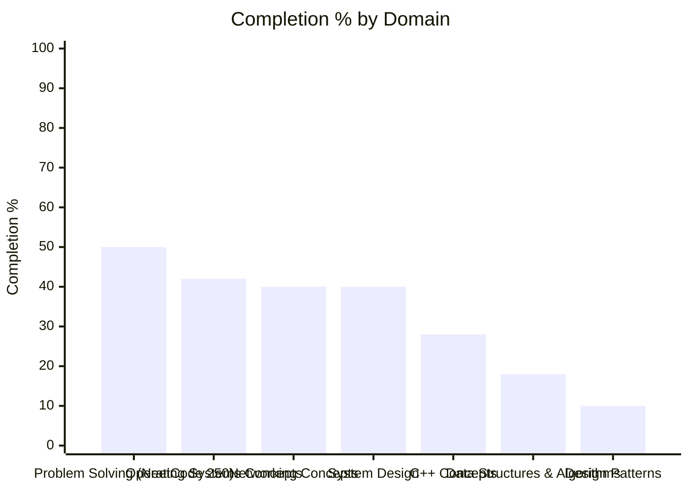

# 🪞 Self-Reflection Dashboard

> ⚙️ **Auto-generated** — do not edit by hand. Run `python Dashboard/generate_dashboard.py` to refresh.
> 🕒 **Last generated:** June 17, 2026 07:54
> 📚 **Domains tracked:** 7

> 🔎 **Per-topic dashboards:** each domain below links to a focused breakdown under [`domains/`](domains/).

---

## 🎯 Overall Progress

### `██████░░░░░░░░░░░░░░` **31.9%**

- ✅ **Completed:** 433 / 1356 items
- ⚖️ **Priority-weighted score:** 35.3% *(Must Know ×3, Should Know ×2, Nice to Have ×1)*
- 🗂️ **Remaining:** 923 items

### 📊 Completion by Domain

> ℹ️ *If the bar chart above does not render, your Markdown viewer needs a recent Mermaid version. The table below always works.*

## 🧭 Domain Breakdown

| Domain | Progress | Done | Must-Know | Weighted | Items | Sections | Last Analyzed | Fresh |
|--------|----------|------|-----------|----------|-------|----------|---------------|-------|
| **[Problem Solving (NeetCode 250)](domains/problem-solving-neetcode-250.md)** | `█████░░░░░` | 50% | — | 50% | 103/206 | 19 | April 7, 2026 | 🔴 71d |
| **[Operating Systems Concepts](domains/operating-systems-concepts.md)** | `████░░░░░░` | 42% | 88% | 51% | 73/174 | 13 | April 7, 2026 | 🔴 71d |
| **[Networking Concepts](domains/networking-concepts.md)** | `████░░░░░░` | 40% | 75% | 49% | 73/184 | 11 | April 7, 2026 | 🔴 71d |
| **[System Design](domains/system-design.md)** | `████░░░░░░` | 40% | 67% | 49% | 82/207 | 15 | April 7, 2026 | 🔴 71d |
| **[C++ Concepts](domains/c-concepts.md)** | `███░░░░░░░` | 28% | 44% | 29% | 43/156 | 12 | April 7, 2026 | 🔴 71d |
| **[Data Structures & Algorithms](domains/data-structures-algorithms.md)** | `██░░░░░░░░` | 18% | 30% | 21% | 36/205 | 14 | April 7, 2026 | 🔴 71d |
| **[Design Patterns](domains/design-patterns.md)** | `█░░░░░░░░░` | 10% | 20% | 11% | 23/224 | 8 | April 7, 2026 | 🔴 71d |

## 🏷️ Priority Breakdown (all domains)

| Priority | Progress | Completed | % |
|----------|----------|-----------|---|
| 🔵 Must Know | `█████░░░░░` | 179/340 | 53% |
| 🟢 Should Know | `█░░░░░░░░░` | 31/295 | 11% |
| ⚪ Nice to Have | `░░░░░░░░░░` | 0/47 | 0% |
| ▫️ Untagged | `███░░░░░░░` | 223/674 | 33% |

## 🔴 Focus Next

*Lowest Must-Know coverage — highest leverage for interview readiness.*

1. **[Design Patterns](domains/design-patterns.md)** — Must-Know at **20%** (52 must-know item(s) left, 10% overall)
1. **[Data Structures & Algorithms](domains/data-structures-algorithms.md)** — Must-Know at **30%** (40 must-know item(s) left, 18% overall)
1. **[C++ Concepts](domains/c-concepts.md)** — Must-Know at **44%** (27 must-know item(s) left, 28% overall)

## 🏆 Strongest Areas

- **[Problem Solving (NeetCode 250)](domains/problem-solving-neetcode-250.md)** — 50% complete 💪
- **[Operating Systems Concepts](domains/operating-systems-concepts.md)** — 42% complete 💪
- **[Networking Concepts](domains/networking-concepts.md)** — 40% complete 💪

## 📅 Freshness Report

*Domains not re-analyzed recently may be out of date with your code.*

| Domain | Last Analyzed | Age | Status |
|--------|---------------|-----|--------|
| [C++ Concepts](domains/c-concepts.md) | April 7, 2026 | 71d | 🔴 Stale |
| [Data Structures & Algorithms](domains/data-structures-algorithms.md) | April 7, 2026 | 71d | 🔴 Stale |
| [Design Patterns](domains/design-patterns.md) | April 7, 2026 | 71d | 🔴 Stale |
| [Networking Concepts](domains/networking-concepts.md) | April 7, 2026 | 71d | 🔴 Stale |
| [Operating Systems Concepts](domains/operating-systems-concepts.md) | April 7, 2026 | 71d | 🔴 Stale |
| [Problem Solving (NeetCode 250)](domains/problem-solving-neetcode-250.md) | April 7, 2026 | 71d | 🔴 Stale |
| [System Design](domains/system-design.md) | April 7, 2026 | 71d | 🔴 Stale |

---

Generated by `Dashboard/generate_dashboard.py` · data source: `SE-Journey/Analysis-Curriculum-coverage/**/*-covered.md`
