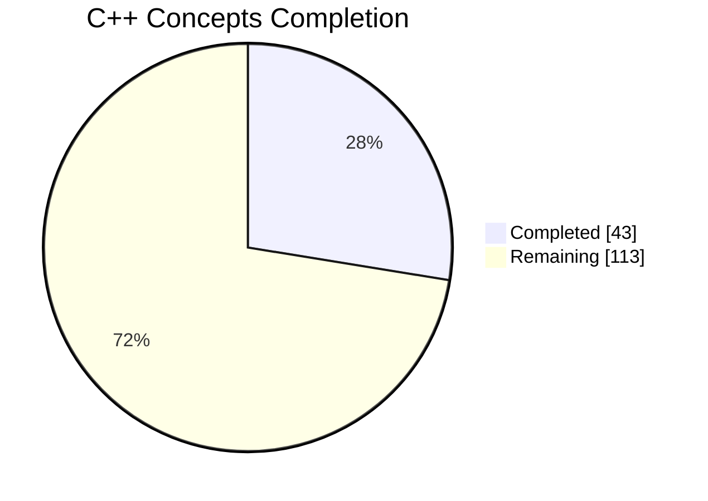
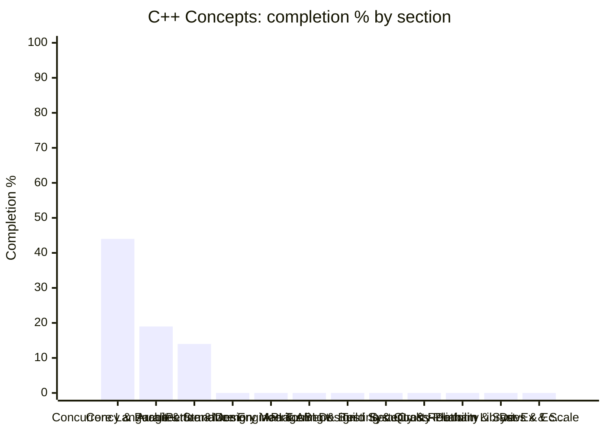

# 🪞 C++ Concepts — Topic Dashboard

> ⚙️ **Auto-generated** — do not edit by hand. Run `python Dashboard/generate_dashboard.py` to refresh.
> 🕒 **Last generated:** June 17, 2026 07:54
> 📅 **Last analyzed:** April 7, 2026 (🔴 71d)
> 🗂️ **Source folders:** Concurrency/, CPP_Concepts/
> ↩️ **Back to:** [Consolidated dashboard](../DASHBOARD.md)

---

## 🎯 Domain Progress

### `██████░░░░░░░░░░░░░░` **27.6%**

- ✅ **Completed:** 43 / 156 items
- ⚖️ **Priority-weighted score:** 29.3% *(Must Know ×3, Should Know ×2, Nice to Have ×1)*
- 🔵 **Must-Know coverage:** 43.8%
- 🗂️ **Remaining:** 113 items
- 🧩 **Sections tracked:** 12

### 📊 Completion by Section

> ℹ️ *If the chart does not render, the table below always works.*

## 🧭 Section Breakdown

| Section | Progress | Done | Must-Know | Weighted | Items | Status |
|---------|----------|------|-----------|----------|-------|--------|
| **Concurrency & Parallelism** | `████░░░░░░` | 44% | 69% | 47% | 15/34 | 🟡 In Progress |
| **Core Language & Standard Library** | `██░░░░░░░░` | 19% | 34% | 22% | 15/77 | 🟡 In Progress |
| **Architecture & Design** | `█░░░░░░░░░` | 14% | 33% | 19% | 1/7 | 🟡 In Progress |
| **Performance Engineering** | `░░░░░░░░░░` | 0% | — | 0% | 0/4 | 🔴 Not Started |
| **Memory Management** | `░░░░░░░░░░` | 0% | — | 0% | 0/3 | 🔴 Not Started |
| **API & ABI Design** | `░░░░░░░░░░` | 0% | — | 0% | 0/3 | 🔴 Not Started |
| **Tooling & Build Systems** | `░░░░░░░░░░` | 0% | — | 0% | 0/3 | 🔴 Not Started |
| **Testing & Quality** | `░░░░░░░░░░` | 0% | — | 0% | 0/3 | 🔴 Not Started |
| **Security & Reliability** | `░░░░░░░░░░` | 0% | — | 0% | 0/3 | 🔴 Not Started |
| **Cross-Platform & Systems** | `░░░░░░░░░░` | 0% | — | 0% | 0/2 | 🔴 Not Started |
| **Domain Libraries & Ecosystem** | `░░░░░░░░░░` | 0% | — | 0% | 0/3 | 🔴 Not Started |
| **DevEx & Scale** | `░░░░░░░░░░` | 0% | — | 0% | 0/2 | 🔴 Not Started |

## 🏷️ Priority Breakdown

| Priority | Progress | Completed | % |
|----------|----------|-----------|---|
| 🔵 Must Know | `████░░░░░░` | 21/48 | 44% |
| 🟢 Should Know | `░░░░░░░░░░` | 1/42 | 2% |
| ⚪ Nice to Have | `░░░░░░░░░░` | 0/13 | 0% |
| ▫️ Untagged | `████░░░░░░` | 21/53 | 40% |

## 🔴 Focus Next

*Lowest-coverage sections — highest leverage inside this domain.*

1. **Performance Engineering** — **0%** (4 item(s) left)
1. **Memory Management** — **0%** (3 item(s) left)
1. **API & ABI Design** — **0%** (3 item(s) left)
1. **Tooling & Build Systems** — **0%** (3 item(s) left)
1. **Testing & Quality** — **0%** (3 item(s) left)

## 🏆 Strongest Sections

- **Concurrency & Parallelism** — 44% complete 💪
- **Core Language & Standard Library** — 19% complete 💪
- **Architecture & Design** — 14% complete 💪

---

Generated by `Dashboard/generate_dashboard.py` · source: `Cpp-concepts-covered.md`
