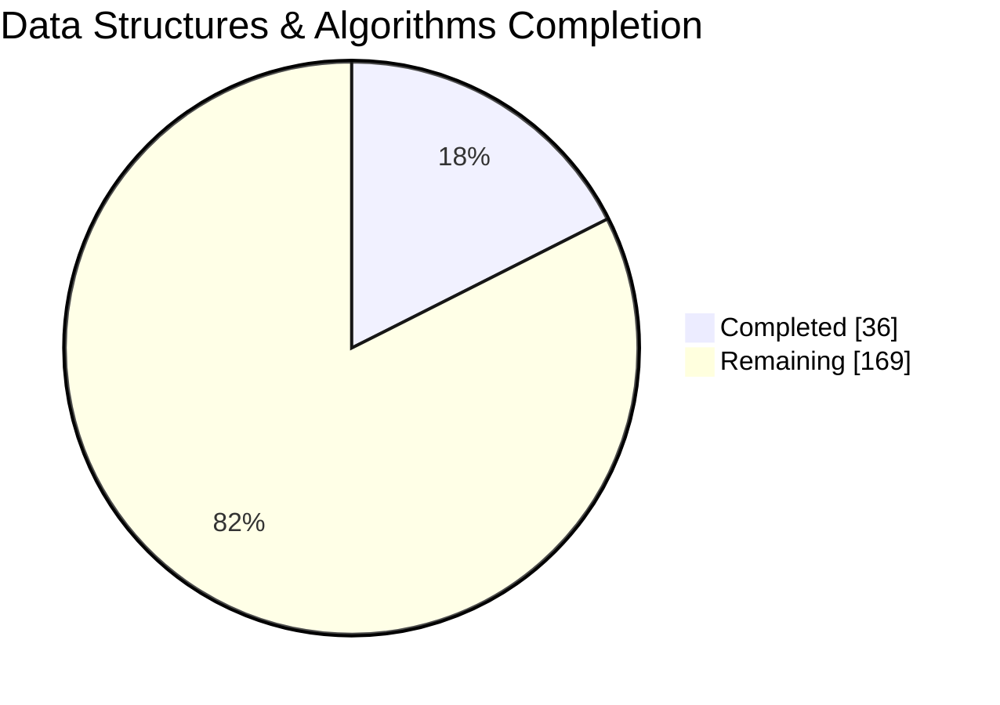
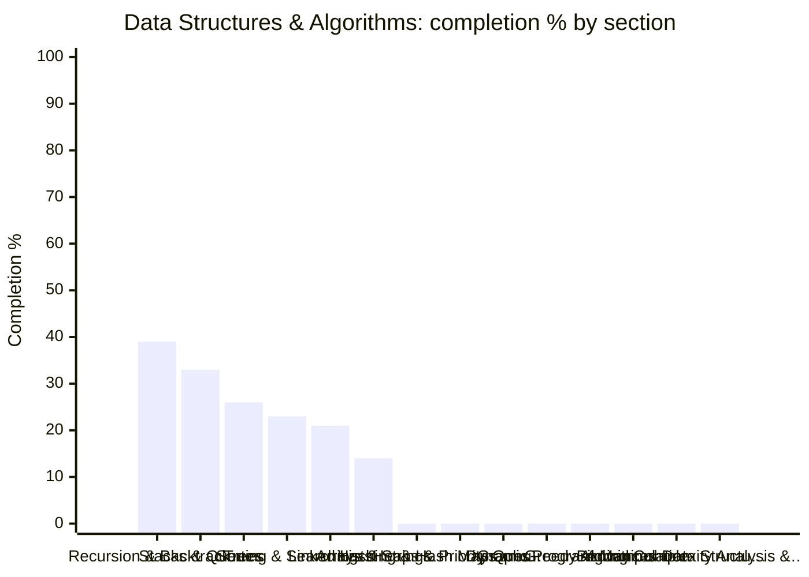

# 🪞 Data Structures & Algorithms — Topic Dashboard

> ⚙️ **Auto-generated** — do not edit by hand. Run `python Dashboard/generate_dashboard.py` to refresh.
> 🕒 **Last generated:** June 17, 2026 07:54
> 📅 **Last analyzed:** April 7, 2026 (🔴 71d)
> 🗂️ **Source folders:** DS_Algo/
> ↩️ **Back to:** [Consolidated dashboard](../DASHBOARD.md)

---

## 🎯 Domain Progress

### `████░░░░░░░░░░░░░░░░` **17.6%**

- ✅ **Completed:** 36 / 205 items
- ⚖️ **Priority-weighted score:** 20.9% *(Must Know ×3, Should Know ×2, Nice to Have ×1)*
- 🔵 **Must-Know coverage:** 29.8%
- 🗂️ **Remaining:** 169 items
- 🧩 **Sections tracked:** 14

### 📊 Completion by Section

> ℹ️ *If the chart does not render, the table below always works.*

## 🧭 Section Breakdown

| Section | Progress | Done | Must-Know | Weighted | Items | Status |
|---------|----------|------|-----------|----------|-------|--------|
| **Recursion & Backtracking** | `████░░░░░░` | 39% | 56% | 42% | 9/23 | 🟡 In Progress |
| **Stacks & Queues** | `███░░░░░░░` | 33% | 29% | 31% | 6/18 | 🟡 In Progress |
| **Trees** | `███░░░░░░░` | 26% | 30% | 27% | 7/27 | 🟡 In Progress |
| **Sorting & Searching** | `██░░░░░░░░` | 23% | 33% | 23% | 6/26 | 🟡 In Progress |
| **Linked Lists** | `██░░░░░░░░` | 21% | 22% | 22% | 4/19 | 🟡 In Progress |
| **Arrays & Strings** | `█░░░░░░░░░` | 14% | 15% | 13% | 4/28 | 🟡 In Progress |
| **Hashing & Hash Maps** | `░░░░░░░░░░` | 0% | — | 0% | 0/9 | 🔴 Not Started |
| **Heaps & Priority Queues** | `░░░░░░░░░░` | 0% | — | 0% | 0/8 | 🔴 Not Started |
| **Graphs** | `░░░░░░░░░░` | 0% | — | 0% | 0/14 | 🔴 Not Started |
| **Dynamic Programming** | `░░░░░░░░░░` | 0% | — | 0% | 0/16 | 🔴 Not Started |
| **Greedy Algorithms** | `░░░░░░░░░░` | 0% | — | 0% | 0/4 | 🔴 Not Started |
| **Bit Manipulation** | `░░░░░░░░░░` | 0% | — | 0% | 0/4 | 🔴 Not Started |
| **Advanced Data Structures** | `░░░░░░░░░░` | 0% | — | 0% | 0/6 | 🔴 Not Started |
| **Complexity Analysis & Problem-Solving Strategies** | `░░░░░░░░░░` | 0% | — | 0% | 0/3 | 🔴 Not Started |

## 🏷️ Priority Breakdown

| Priority | Progress | Completed | % |
|----------|----------|-----------|---|
| 🔵 Must Know | `███░░░░░░░` | 17/57 | 30% |
| 🟢 Should Know | `█░░░░░░░░░` | 3/31 | 10% |
| ⚪ Nice to Have | `░░░░░░░░░░` | 0/5 | 0% |
| ▫️ Untagged | `█░░░░░░░░░` | 16/112 | 14% |

## 🔴 Focus Next

*Lowest-coverage sections — highest leverage inside this domain.*

1. **Hashing & Hash Maps** — **0%** (9 item(s) left)
1. **Heaps & Priority Queues** — **0%** (8 item(s) left)
1. **Graphs** — **0%** (14 item(s) left)
1. **Dynamic Programming** — **0%** (16 item(s) left)
1. **Greedy Algorithms** — **0%** (4 item(s) left)

## 🏆 Strongest Sections

- **Recursion & Backtracking** — 39% complete 💪
- **Stacks & Queues** — 33% complete 💪
- **Trees** — 26% complete 💪
- **Sorting & Searching** — 23% complete 💪
- **Linked Lists** — 21% complete 💪

---

Generated by `Dashboard/generate_dashboard.py` · source: `DS-Algo-concepts-covered.md`
