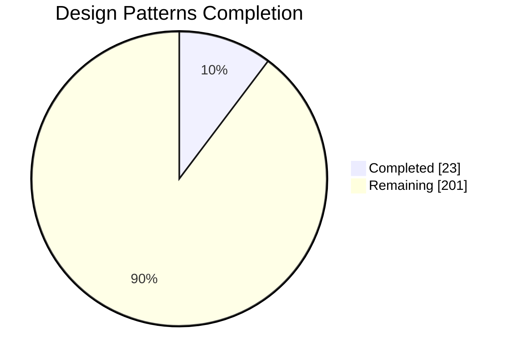
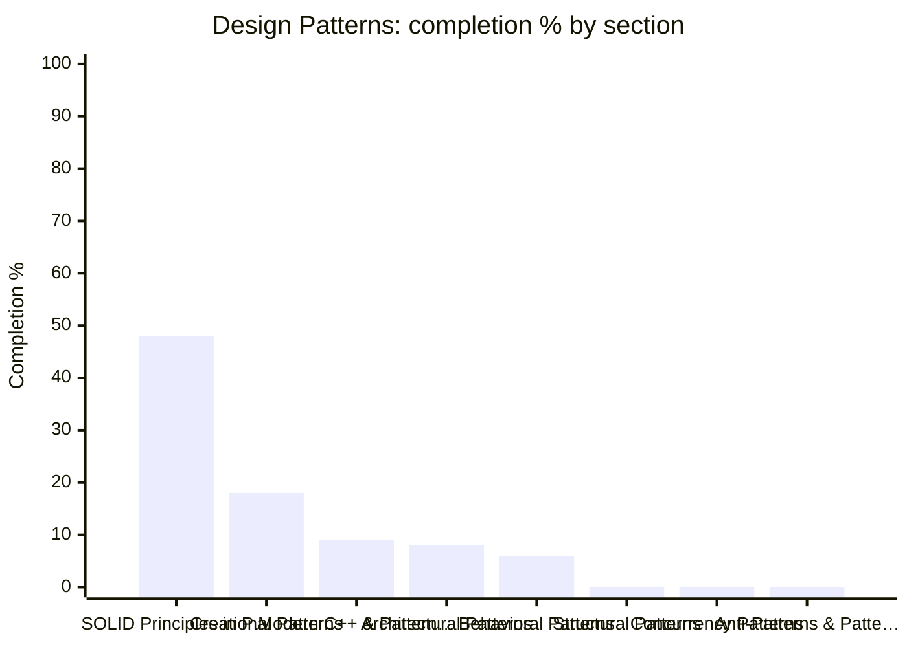

# 🪞 Design Patterns — Topic Dashboard

> ⚙️ **Auto-generated** — do not edit by hand. Run `python Dashboard/generate_dashboard.py` to refresh.
> 🕒 **Last generated:** June 17, 2026 07:54
> 📅 **Last analyzed:** April 7, 2026 (🔴 71d)
> 🗂️ **Source folders:** DesignPatterns/
> ↩️ **Back to:** [Consolidated dashboard](../DASHBOARD.md)

---

## 🎯 Domain Progress

### `██░░░░░░░░░░░░░░░░░░` **10.3%**

- ✅ **Completed:** 23 / 224 items
- ⚖️ **Priority-weighted score:** 10.9% *(Must Know ×3, Should Know ×2, Nice to Have ×1)*
- 🔵 **Must-Know coverage:** 20.0%
- 🗂️ **Remaining:** 201 items
- 🧩 **Sections tracked:** 8

### 📊 Completion by Section

> ℹ️ *If the chart does not render, the table below always works.*

## 🧭 Section Breakdown

| Section | Progress | Done | Must-Know | Weighted | Items | Status |
|---------|----------|------|-----------|----------|-------|--------|
| **SOLID Principles in Practice** | `█████░░░░░` | 48% | 56% | 43% | 10/21 | 🟡 In Progress |
| **Creational Patterns** | `██░░░░░░░░` | 18% | 44% | 21% | 6/34 | 🟡 In Progress |
| **Modern C++ & Pattern Evolution** | `█░░░░░░░░░` | 9% | 20% | 10% | 2/22 | 🟡 In Progress |
| **Architectural Patterns** | `█░░░░░░░░░` | 8% | 20% | 8% | 2/25 | 🟡 In Progress |
| **Behavioral Patterns** | `█░░░░░░░░░` | 6% | 14% | 7% | 3/52 | 🟡 In Progress |
| **Structural Patterns** | `░░░░░░░░░░` | 0% | 0% | 0% | 0/35 | 🔴 Not Started |
| **Concurrency Patterns** | `░░░░░░░░░░` | 0% | 0% | 0% | 0/25 | 🔴 Not Started |
| **Anti-Patterns & Pattern Misuse** | `░░░░░░░░░░` | 0% | 0% | 0% | 0/10 | 🔴 Not Started |

## 🏷️ Priority Breakdown

| Priority | Progress | Completed | % |
|----------|----------|-----------|---|
| 🔵 Must Know | `██░░░░░░░░` | 13/65 | 20% |
| 🟢 Should Know | `░░░░░░░░░░` | 0/94 | 0% |
| ⚪ Nice to Have | `░░░░░░░░░░` | 0/20 | 0% |
| ▫️ Untagged | `██░░░░░░░░` | 10/45 | 22% |

## 🔴 Focus Next

*Lowest-coverage sections — highest leverage inside this domain.*

1. **Structural Patterns** — 0% overall, Must-Know at 0% (12 must-know / 35 total item(s) left)
1. **Concurrency Patterns** — 0% overall, Must-Know at 0% (8 must-know / 25 total item(s) left)
1. **Anti-Patterns & Pattern Misuse** — 0% overall, Must-Know at 0% (3 must-know / 10 total item(s) left)
1. **Behavioral Patterns** — 6% overall, Must-Know at 14% (12 must-know / 49 total item(s) left)
1. **Architectural Patterns** — 8% overall, Must-Know at 20% (4 must-know / 23 total item(s) left)

## 🏆 Strongest Sections

- **SOLID Principles in Practice** — 48% complete 💪
- **Creational Patterns** — 18% complete 💪
- **Modern C++ & Pattern Evolution** — 9% complete 💪
- **Architectural Patterns** — 8% complete 💪
- **Behavioral Patterns** — 6% complete 💪

---

Generated by `Dashboard/generate_dashboard.py` · source: `design-patterns-covered.md`
