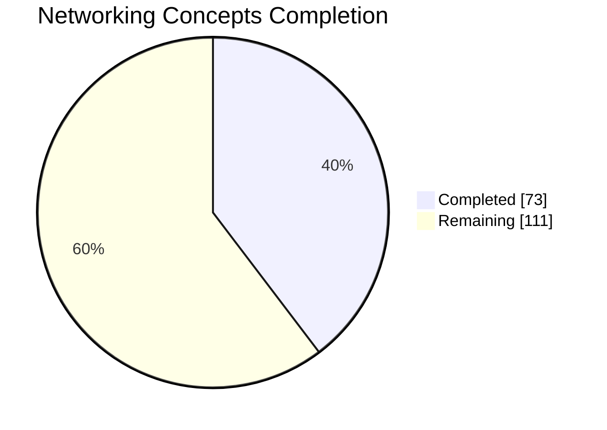
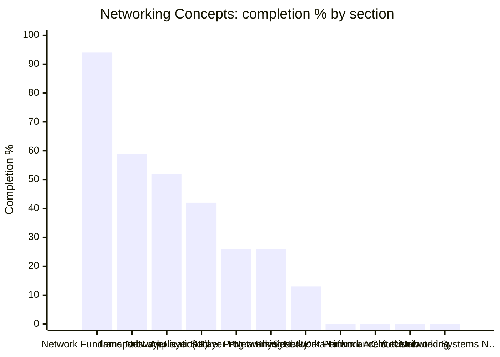

# 🪞 Networking Concepts — Topic Dashboard

> ⚙️ **Auto-generated** — do not edit by hand. Run `python Dashboard/generate_dashboard.py` to refresh.
> 🕒 **Last generated:** June 17, 2026 07:54
> 📅 **Last analyzed:** April 7, 2026 (🔴 71d)
> 🗂️ **Source folders:** Networking-Concepts/
> ↩️ **Back to:** [Consolidated dashboard](../DASHBOARD.md)

---

## 🎯 Domain Progress

### `████████░░░░░░░░░░░░` **39.7%**

- ✅ **Completed:** 73 / 184 items
- ⚖️ **Priority-weighted score:** 48.7% *(Must Know ×3, Should Know ×2, Nice to Have ×1)*
- 🔵 **Must-Know coverage:** 75.0%
- 🗂️ **Remaining:** 111 items
- 🧩 **Sections tracked:** 11

### 📊 Completion by Section

> ℹ️ *If the chart does not render, the table below always works.*

## 🧭 Section Breakdown

| Section | Progress | Done | Must-Know | Weighted | Items | Status |
|---------|----------|------|-----------|----------|-------|--------|
| **Network Fundamentals & OSI/TCP-IP Models** | `█████████░` | 94% | 100% | 94% | 15/16 | 🟢 Strong |
| **Transport Layer** | `██████░░░░` | 59% | 93% | 66% | 17/29 | 🟡 In Progress |
| **Network Layer (IP)** | `█████░░░░░` | 52% | 80% | 56% | 15/29 | 🟡 In Progress |
| **Application Layer Protocols** | `████░░░░░░` | 42% | 67% | 47% | 13/31 | 🟡 In Progress |
| **Socket Programming** | `███░░░░░░░` | 26% | 57% | 38% | 5/19 | 🟡 In Progress |
| **Network Security** | `███░░░░░░░` | 26% | 67% | 35% | 6/23 | 🟡 In Progress |
| **Physical & Data Link Layer** | `█░░░░░░░░░` | 13% | 25% | 14% | 2/15 | 🟡 In Progress |
| **Network Performance & Debugging** | `░░░░░░░░░░` | 0% | — | 0% | 0/6 | 🔴 Not Started |
| **Network Architecture & Design** | `░░░░░░░░░░` | 0% | — | 0% | 0/5 | 🔴 Not Started |
| **Cloud Networking** | `░░░░░░░░░░` | 0% | — | 0% | 0/5 | 🔴 Not Started |
| **Distributed Systems Networking** | `░░░░░░░░░░` | 0% | — | 0% | 0/6 | 🔴 Not Started |

## 🏷️ Priority Breakdown

| Priority | Progress | Completed | % |
|----------|----------|-----------|---|
| 🔵 Must Know | `████████░░` | 45/60 | 75% |
| 🟢 Should Know | `██░░░░░░░░` | 8/47 | 17% |
| ⚪ Nice to Have | `░░░░░░░░░░` | 0/6 | 0% |
| ▫️ Untagged | `███░░░░░░░` | 20/71 | 28% |

## 🔴 Focus Next

*Lowest-coverage sections — highest leverage inside this domain.*

1. **Network Performance & Debugging** — **0%** (6 item(s) left)
1. **Network Architecture & Design** — **0%** (5 item(s) left)
1. **Cloud Networking** — **0%** (5 item(s) left)
1. **Distributed Systems Networking** — **0%** (6 item(s) left)
1. **Physical & Data Link Layer** — 13% overall, Must-Know at 25% (3 must-know / 13 total item(s) left)

## 🏆 Strongest Sections

- **Network Fundamentals & OSI/TCP-IP Models** — 94% complete 💪
- **Transport Layer** — 59% complete 💪
- **Network Layer (IP)** — 52% complete 💪
- **Application Layer Protocols** — 42% complete 💪
- **Socket Programming** — 26% complete 💪

---

Generated by `Dashboard/generate_dashboard.py` · source: `Networking-concepts-covered.md`
