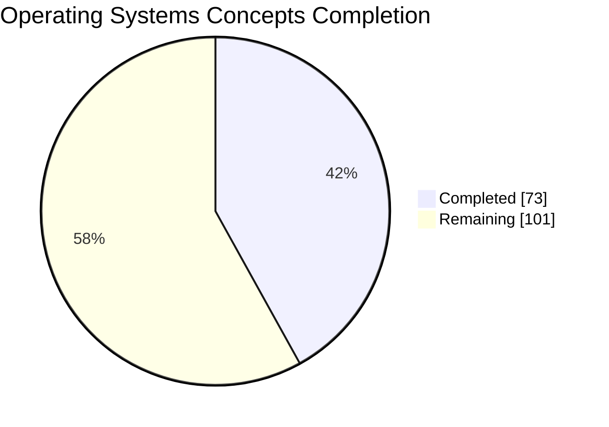
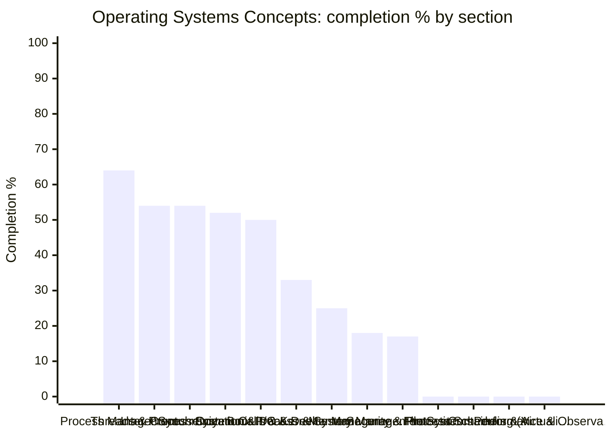

# 🪞 Operating Systems Concepts — Topic Dashboard

> ⚙️ **Auto-generated** — do not edit by hand. Run `python Dashboard/generate_dashboard.py` to refresh.
> 🕒 **Last generated:** June 17, 2026 07:54
> 📅 **Last analyzed:** April 7, 2026 (🔴 71d)
> 🗂️ **Source folders:** OS-COncepts/
> ↩️ **Back to:** [Consolidated dashboard](../DASHBOARD.md)

---

## 🎯 Domain Progress

### `████████░░░░░░░░░░░░` **42.0%**

- ✅ **Completed:** 73 / 174 items
- ⚖️ **Priority-weighted score:** 51.5% *(Must Know ×3, Should Know ×2, Nice to Have ×1)*
- 🔵 **Must-Know coverage:** 88.4%
- 🗂️ **Remaining:** 101 items
- 🧩 **Sections tracked:** 13

### 📊 Completion by Section

> ℹ️ *If the chart does not render, the table below always works.*

## 🧭 Section Breakdown

| Section | Progress | Done | Must-Know | Weighted | Items | Status |
|---------|----------|------|-----------|----------|-------|--------|
| **Process Management** | `██████░░░░` | 64% | 100% | 70% | 18/28 | 🟡 In Progress |
| **Threads & Concurrency** | `█████░░░░░` | 54% | 100% | 60% | 13/24 | 🟡 In Progress |
| **Inter-Process Communication (IPC)** | `█████░░░░░` | 54% | 100% | 70% | 7/13 | 🟡 In Progress |
| **Synchronization & Deadlocks** | `█████░░░░░` | 52% | 100% | 55% | 22/42 | 🟡 In Progress |
| **System Calls & Kernel Interface** | `█████░░░░░` | 50% | 67% | 53% | 5/10 | 🟡 In Progress |
| **Boot Process & System Initialization** | `███░░░░░░░` | 33% | — | 33% | 1/3 | 🟡 In Progress |
| **I/O & Device Management** | `██░░░░░░░░` | 25% | — | 25% | 1/4 | 🟡 In Progress |
| **Memory Management** | `██░░░░░░░░` | 18% | 50% | 28% | 5/28 | 🟡 In Progress |
| **Security & Protection** | `██░░░░░░░░` | 17% | — | 17% | 1/6 | 🟡 In Progress |
| **File Systems** | `░░░░░░░░░░` | 0% | — | 0% | 0/1 | 🔴 Not Started |
| **Process Scheduling (Advanced)** | `░░░░░░░░░░` | 0% | — | 0% | 0/4 | 🔴 Not Started |
| **Containers & Virtualization** | `░░░░░░░░░░` | 0% | — | 0% | 0/4 | 🔴 Not Started |
| **Performance & Observability** | `░░░░░░░░░░` | 0% | — | 0% | 0/7 | 🔴 Not Started |

## 🏷️ Priority Breakdown

| Priority | Progress | Completed | % |
|----------|----------|-----------|---|
| 🔵 Must Know | `█████████░` | 38/43 | 88% |
| 🟢 Should Know | `██░░░░░░░░` | 8/45 | 18% |
| ⚪ Nice to Have | `░░░░░░░░░░` | 0/2 | 0% |
| ▫️ Untagged | `███░░░░░░░` | 27/84 | 32% |

## 🔴 Focus Next

*Lowest-coverage sections — highest leverage inside this domain.*

1. **File Systems** — **0%** (1 item(s) left)
1. **Process Scheduling (Advanced)** — **0%** (4 item(s) left)
1. **Containers & Virtualization** — **0%** (4 item(s) left)
1. **Performance & Observability** — **0%** (7 item(s) left)
1. **Security & Protection** — **17%** (5 item(s) left)

## 🏆 Strongest Sections

- **Process Management** — 64% complete 💪
- **Threads & Concurrency** — 54% complete 💪
- **Inter-Process Communication (IPC)** — 54% complete 💪
- **Synchronization & Deadlocks** — 52% complete 💪
- **System Calls & Kernel Interface** — 50% complete 💪

---

Generated by `Dashboard/generate_dashboard.py` · source: `OS-concepts-covered.md`
