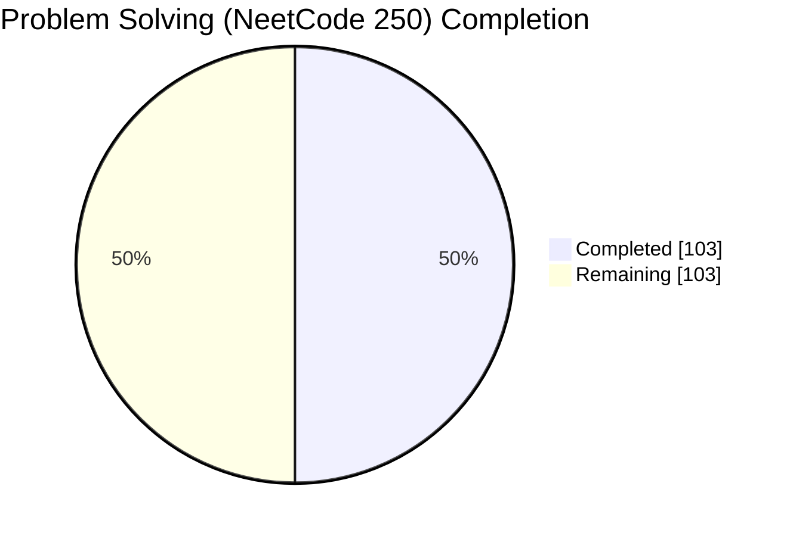
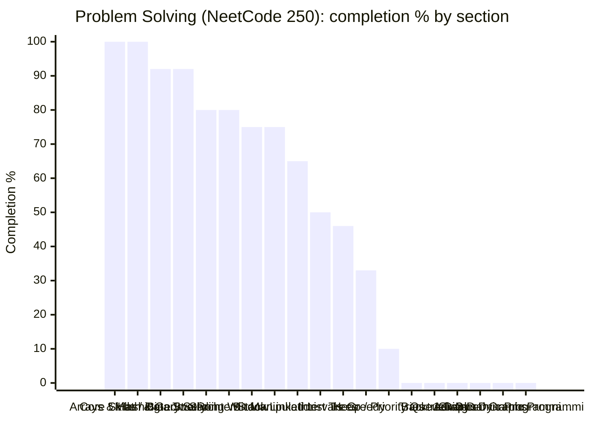

# 🪞 Problem Solving (NeetCode 250) — Topic Dashboard

> ⚙️ **Auto-generated** — do not edit by hand. Run `python Dashboard/generate_dashboard.py` to refresh.
> 🕒 **Last generated:** June 17, 2026 07:54
> 📅 **Last analyzed:** April 7, 2026 (🔴 71d)
> 🗂️ **Source folders:** NeetCode250/
> ↩️ **Back to:** [Consolidated dashboard](../DASHBOARD.md)

---

## 🎯 Domain Progress

### `██████████░░░░░░░░░░` **50.0%**

- ✅ **Completed:** 103 / 206 items
- ⚖️ **Priority-weighted score:** 50.0% *(Must Know ×3, Should Know ×2, Nice to Have ×1)*
- 🔵 **Must-Know coverage:** — *(no Must-Know items tagged)*
- 🗂️ **Remaining:** 103 items
- 🧩 **Sections tracked:** 19

### 📊 Completion by Section

> ℹ️ *If the chart does not render, the table below always works.*

## 🧭 Section Breakdown

| Section | Progress | Done | Must-Know | Weighted | Items | Status |
|---------|----------|------|-----------|----------|-------|--------|
| **Arrays & Hashing** | `██████████` | 100% | — | 100% | 13/13 | ✅ Complete |
| **Core Skills / Data Structure Implementation** | `██████████` | 100% | — | 100% | 1/1 | ✅ Complete |
| **Math & Geometry** | `█████████░` | 92% | — | 92% | 12/13 | 🟢 Strong |
| **Binary Search** | `█████████░` | 92% | — | 92% | 11/12 | 🟢 Strong |
| **Two Pointers** | `████████░░` | 80% | — | 80% | 8/10 | 🟢 Strong |
| **Sliding Window** | `████████░░` | 80% | — | 80% | 8/10 | 🟢 Strong |
| **Stack** | `████████░░` | 75% | — | 75% | 9/12 | 🟢 Strong |
| **Bit Manipulation** | `████████░░` | 75% | — | 75% | 9/12 | 🟢 Strong |
| **Linked List** | `██████░░░░` | 65% | — | 65% | 11/17 | 🟡 In Progress |
| **Intervals** | `█████░░░░░` | 50% | — | 50% | 5/10 | 🟡 In Progress |
| **Trees** | `█████░░░░░` | 46% | — | 46% | 11/24 | 🟡 In Progress |
| **Greedy** | `███░░░░░░░` | 33% | — | 33% | 4/12 | 🟡 In Progress |
| **Heap / Priority Queue** | `█░░░░░░░░░` | 10% | — | 10% | 1/10 | 🟡 In Progress |
| **Tries** | `░░░░░░░░░░` | 0% | — | 0% | 0/4 | 🔴 Not Started |
| **Backtracking** | `░░░░░░░░░░` | 0% | — | 0% | 0/10 | 🔴 Not Started |
| **Graphs** | `░░░░░░░░░░` | 0% | — | 0% | 0/14 | 🔴 Not Started |
| **Advanced Graphs** | `░░░░░░░░░░` | 0% | — | 0% | 0/7 | 🔴 Not Started |
| **1-D Dynamic Programming** | `░░░░░░░░░░` | 0% | — | 0% | 0/13 | 🔴 Not Started |
| **2-D Dynamic Programming** | `░░░░░░░░░░` | 0% | — | 0% | 0/2 | 🔴 Not Started |

## 🏷️ Priority Breakdown

| Priority | Progress | Completed | % |
|----------|----------|-----------|---|
| ▫️ Untagged | `█████░░░░░` | 103/206 | 50% |

## 🔴 Focus Next

*Lowest-coverage sections — highest leverage inside this domain.*

1. **Tries** — **0%** (4 item(s) left)
1. **Backtracking** — **0%** (10 item(s) left)
1. **Graphs** — **0%** (14 item(s) left)
1. **Advanced Graphs** — **0%** (7 item(s) left)
1. **1-D Dynamic Programming** — **0%** (13 item(s) left)

## 🏆 Strongest Sections

- **Arrays & Hashing** — 100% complete 💪
- **Core Skills / Data Structure Implementation** — 100% complete 💪
- **Math & Geometry** — 92% complete 💪
- **Binary Search** — 92% complete 💪
- **Two Pointers** — 80% complete 💪

---

Generated by `Dashboard/generate_dashboard.py` · source: `Problem-Solving-covered.md`
