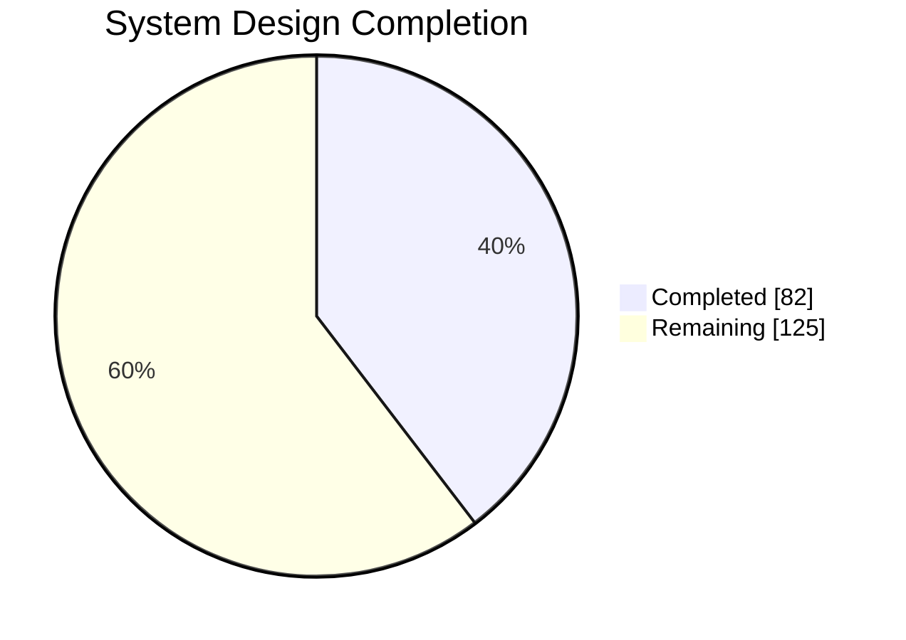
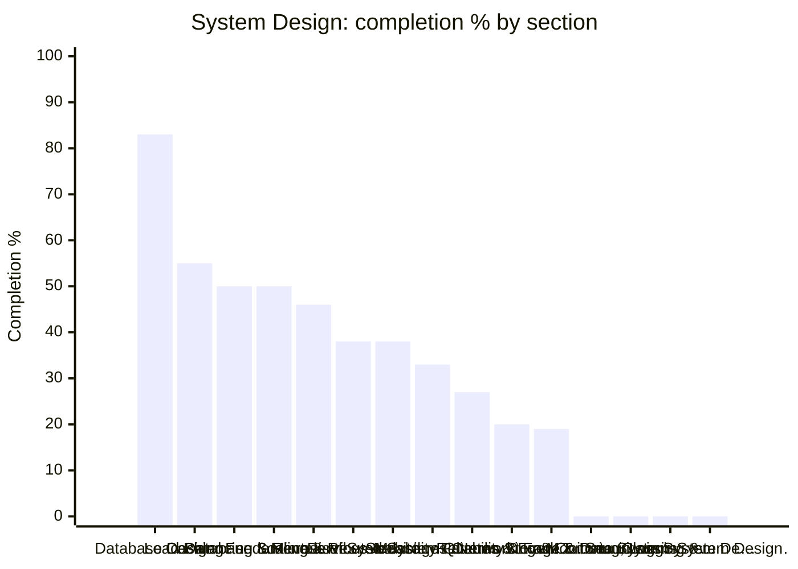

# 🪞 System Design — Topic Dashboard

> ⚙️ **Auto-generated** — do not edit by hand. Run `python Dashboard/generate_dashboard.py` to refresh.
> 🕒 **Last generated:** June 17, 2026 07:54
> 📅 **Last analyzed:** April 7, 2026 (🔴 71d)
> 🗂️ **Source folders:** SYSTEM-DESIGN/
> ↩️ **Back to:** [Consolidated dashboard](../DASHBOARD.md)

---

## 🎯 Domain Progress

### `████████░░░░░░░░░░░░` **39.6%**

- ✅ **Completed:** 82 / 207 items
- ⚖️ **Priority-weighted score:** 48.5% *(Must Know ×3, Should Know ×2, Nice to Have ×1)*
- 🔵 **Must-Know coverage:** 67.2%
- 🗂️ **Remaining:** 125 items
- 🧩 **Sections tracked:** 15

### 📊 Completion by Section

> ℹ️ *If the chart does not render, the table below always works.*

## 🧭 Section Breakdown

| Section | Progress | Done | Must-Know | Weighted | Items | Status |
|---------|----------|------|-----------|----------|-------|--------|
| **Database Design** | `████████░░` | 83% | 75% | 82% | 15/18 | 🟢 Strong |
| **Caching** | `██████░░░░` | 55% | 67% | 60% | 11/20 | 🟡 In Progress |
| **Load Balancing & Reverse Proxy** | `█████░░░░░` | 50% | 86% | 63% | 9/18 | 🟡 In Progress |
| **Database Scaling & Replication** | `█████░░░░░` | 50% | 75% | 56% | 10/20 | 🟡 In Progress |
| **Fundamentals of System Design** | `█████░░░░░` | 46% | 50% | 46% | 11/24 | 🟡 In Progress |
| **Microservices Architecture** | `████░░░░░░` | 38% | 100% | 53% | 5/13 | 🟡 In Progress |
| **Distributed Systems Concepts** | `████░░░░░░` | 38% | 62% | 41% | 8/21 | 🟡 In Progress |
| **Scalability Patterns** | `███░░░░░░░` | 33% | 100% | 56% | 4/12 | 🟡 In Progress |
| **Message Queues & Event Streaming** | `███░░░░░░░` | 27% | — | 27% | 3/11 | 🟡 In Progress |
| **Reliability & Fault Tolerance** | `██░░░░░░░░` | 20% | 100% | 37% | 3/15 | 🟡 In Progress |
| **Networking & Communication** | `██░░░░░░░░` | 19% | 33% | 21% | 3/16 | 🟡 In Progress |
| **Storage & Data Systems** | `░░░░░░░░░░` | 0% | — | 0% | 0/5 | 🔴 Not Started |
| **Monitoring, Logging & Observability** | `░░░░░░░░░░` | 0% | — | 0% | 0/1 | 🔴 Not Started |
| **Security in System Design** | `░░░░░░░░░░` | 0% | — | 0% | 0/1 | 🔴 Not Started |
| **Classic System Design Problems** | `░░░░░░░░░░` | 0% | — | 0% | 0/12 | 🔴 Not Started |

## 🏷️ Priority Breakdown

| Priority | Progress | Completed | % |
|----------|----------|-----------|---|
| 🔵 Must Know | `███████░░░` | 45/67 | 67% |
| 🟢 Should Know | `███░░░░░░░` | 11/36 | 31% |
| ⚪ Nice to Have | `░░░░░░░░░░` | 0/1 | 0% |
| ▫️ Untagged | `███░░░░░░░` | 26/103 | 25% |

## 🔴 Focus Next

*Lowest-coverage sections — highest leverage inside this domain.*

1. **Storage & Data Systems** — **0%** (5 item(s) left)
1. **Monitoring, Logging & Observability** — **0%** (1 item(s) left)
1. **Security in System Design** — **0%** (1 item(s) left)
1. **Classic System Design Problems** — **0%** (12 item(s) left)
1. **Message Queues & Event Streaming** — **27%** (8 item(s) left)

## 🏆 Strongest Sections

- **Database Design** — 83% complete 💪
- **Caching** — 55% complete 💪
- **Load Balancing & Reverse Proxy** — 50% complete 💪
- **Database Scaling & Replication** — 50% complete 💪
- **Fundamentals of System Design** — 46% complete 💪

---

Generated by `Dashboard/generate_dashboard.py` · source: `System-design-concepts-covered.md`
