# Operating System Basics

## Table of Contents
1. [What is an Operating System?](#what-is-an-operating-system)
2. [Computer System Organization](#computer-system-organization)
3. [Interrupt Handling](#interrupt-handling)
4. [Storage Management](#storage-management)
5. [Process Management](#process-management)
6. [Memory Management](#memory-management)
7. [Dual-Mode Operation](#dual-mode-operation)
8. [Protection](#protection)
9. [System Types](#system-types)
10. [Distributed Systems](#distributed-systems)

---

## What is an Operating System?

An **Operating System (OS)** is system software that manages computer hardware and software resources and provides common services for computer programs. It acts as an intermediary between users and computer hardware.

### Working of an Operating System

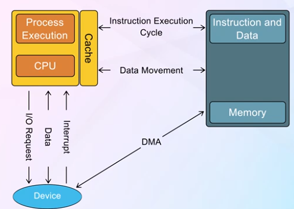

The OS manages various system components and coordinates their interaction to ensure efficient system operation. It provides:
- **Resource allocation**: CPU time, memory space, file-storage space
- **Control program**: Prevents errors and improper use of the computer
- **Kernel**: The core part running at all times
- **System programs**: Associated with the OS but not part of the kernel
- **Application programs**: All other software

---

## Computer System Organization

### Device Controllers and Drivers

**Device controllers** are hardware components that manage specific devices (disk drives, audio devices, graphics adapters). Each controller has:
- Local buffer storage
- Set of special-purpose registers
- Control logic

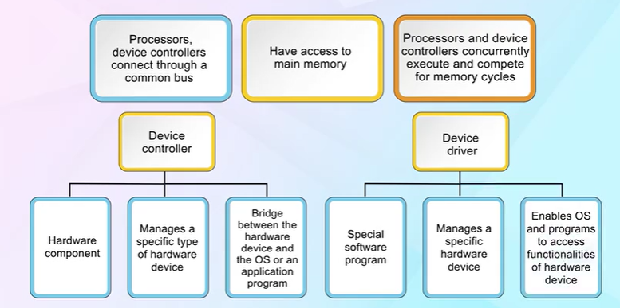

**Device drivers** are software components that provide a uniform interface between the controller and the OS. The device-driver understands the device controller and provides the rest of the OS with a uniform interface to the device.

### Communication Flow

The communication between components follows a structured path:
1. **User Applications** interact with the system through system calls
2. **Operating System** coordinates resource access
3. **Device Drivers** translate OS requests to device-specific operations
4. **Device Controllers** execute operations on hardware
5. **Hardware** performs the actual work

---

## Interrupt Handling

### Interrupts

**Interrupts** are signals that alert the processor to a high-priority condition requiring interruption of current code execution. Types include:
- **Hardware interrupts**: Generated by hardware devices (I/O completion, errors)
- **Software interrupts (traps)**: Generated by software (system calls, exceptions)

### Interrupt Handling Process

The interrupt handling mechanism:
1. **Interrupt occurs**: Device signals the CPU
2. **Save state**: Current process state is saved
3. **Transfer control**: CPU transfers control to interrupt service routine (ISR)
4. **Execute ISR**: Interrupt is serviced
5. **Restore state**: Previous process state is restored
6. **Resume execution**: Normal execution continues

**Key Points:**
- Interrupt vector contains addresses of all service routines
- Interrupt chaining handles multiple devices sharing interrupt lines
- Modern systems use interrupt priorities
- Maskable vs. non-maskable interrupts

---

## Storage Management

### Storage Hierarchy

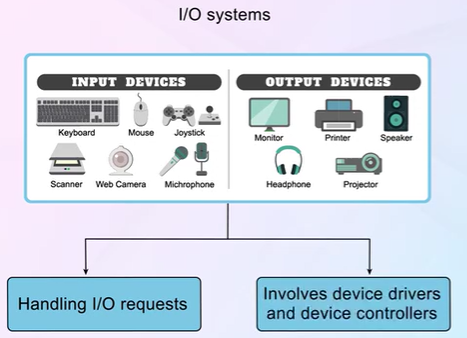

Storage systems are organized hierarchically based on:
- **Speed**: Faster storage is more expensive
- **Cost**: Higher capacity means lower cost per bit
- **Volatility**: Some storage loses data without power

**Hierarchy levels** (fastest to slowest):
1. **Registers**: CPU registers (fastest)
2. **Cache**: L1, L2, L3 cache
3. **Main Memory**: RAM (volatile)
4. **Electronic Disk**: SSD
5. **Magnetic Disk**: HDD
6. **Optical Disk**: CD/DVD
7. **Magnetic Tape**: Backup storage (slowest)

**Caching principles:**
- Information is copied from slower to faster storage temporarily
- If data needed is in cache (cache hit), use cached copy
- If not (cache miss), copy data to cache and use it
- Cache management is crucial for performance

---

## Process Management

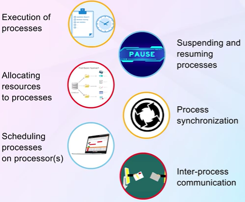

A **process** is a program in execution. Process management involves:

**Responsibilities:**
- **Process creation and deletion**: Both parent and child processes
- **Process scheduling**: Selecting processes for CPU execution
- **Process synchronization**: Coordinating concurrent processes
- **Process communication**: Enabling inter-process communication (IPC)
- **Deadlock handling**: Preventing and resolving deadlocks

**Process states:** New, Ready, Running, Waiting, Terminated

---

## Memory Management

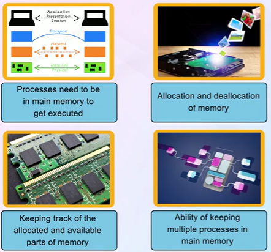

Memory management keeps track of which parts of memory are in use and by whom.

**Key functions:**
- **Memory allocation**: Deciding which processes get memory and when
- **Memory deallocation**: Freeing memory when no longer needed
- **Address translation**: Converting logical addresses to physical addresses
- **Memory protection**: Ensuring processes don't interfere with each other
- **Swapping**: Moving processes between main memory and disk

**Techniques:**
- Contiguous allocation
- Paging
- Segmentation
- Virtual memory

---

## Dual-Mode Operation

### Dual-Mode Concept

Operating systems require two separate modes of operation to protect the system from errant users and processes:

**User Mode:**
- Limited access to system resources
- Cannot execute privileged instructions
- Applications run in this mode

**Kernel Mode (Supervisor/System Mode):**
- Full access to all hardware and memory
- Can execute all CPU instructions
- OS kernel runs in this mode

### Dual-Mode Implementation

**Mode bit** indicates current mode:
- **0 = Kernel mode** (privileged)
- **1 = User mode** (restricted)

**Transition mechanisms:**
- **System calls**: User → Kernel (explicit request)
- **Interrupts**: User → Kernel (hardware event)
- **Exceptions**: User → Kernel (error condition)
- **Return from interrupt/system call**: Kernel → User

**Privileged instructions** (kernel mode only):
- I/O control
- Timer management
- Interrupt management
- Memory management operations

---

## Protection

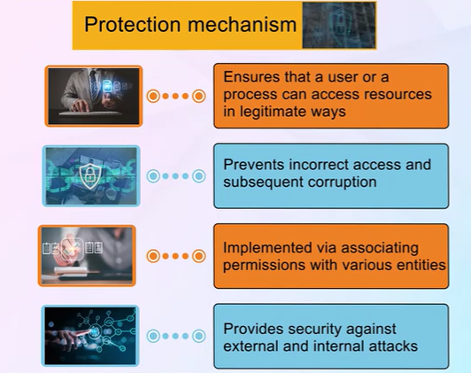

**Protection** mechanisms control access to system resources and prevent unauthorized or incorrect access.

**Key aspects:**
- **Memory protection**: Prevents processes from accessing unauthorized memory
- **CPU protection**: Timer prevents infinite loops from monopolizing CPU
- **I/O protection**: All I/O instructions are privileged
- **File protection**: Access control lists and permissions

**Protection rings:**
- Ring 0: Kernel (highest privilege)
- Ring 1-2: Device drivers
- Ring 3: User applications (lowest privilege)

---

## System Types

### Single Processor Systems (SPS)

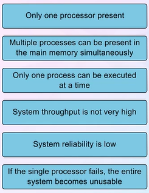

**Characteristics:**
- One main CPU capable of executing general-purpose instruction set
- May have special-purpose processors (disk controllers, keyboard)
- Simple design and management
- Limited performance scalability

**Advantages:**
- Lower cost
- Simpler programming model
- Less complex OS

**Limitations:**
- Performance bottleneck
- No parallel execution
- Single point of failure

### Multiprocessor Systems (MPS)

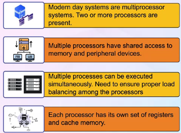

**Characteristics:**
- Two or more processors sharing computer bus, memory, and peripherals
- Also known as parallel systems or tightly-coupled systems
- Processors share physical address space

**Types:**
- **Symmetric Multiprocessing (SMP)**: All processors are peers; each runs identical copy of OS
- **Asymmetric Multiprocessing**: Master-slave relationship; master processor controls system

**Benefits:**
1. **Increased throughput**: More work done in less time
2. **Economy of scale**: Cost effective as resources are shared
3. **Increased reliability**: Graceful degradation or fault tolerance

### Multiprogramming Systems

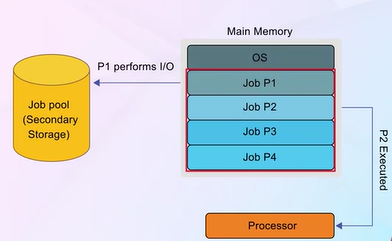

**Multiprogramming** organizes jobs so CPU always has one to execute, increasing CPU utilization.

**Key concepts:**
- **Job pool**: All jobs kept initially on disk in job pool
- **Job scheduling**: OS selects and loads jobs into memory
- **CPU scheduling**: When one job waits (I/O), OS switches CPU to another job

**Benefits:**
- Efficient CPU utilization
- Reduced waiting time
- Better resource utilization

### Multitasking Systems (Time-Sharing)

**Multitasking (Time-sharing)** is a logical extension of multiprogramming where CPU switches jobs so frequently that users can interact with each program while it's running.

**Characteristics:**
- **Response time**: Should be < 1 second
- **Interactive computing**: Users interact directly with system
- **Time quantum**: Each process gets a small time slice
- **Context switching**: Rapid switching between processes

**Requirements:**
- Virtual memory for large process spaces
- File systems for online storage
- CPU scheduling algorithms
- Memory management
- Synchronization and deadlock prevention

### Multicore Systems (MCS)

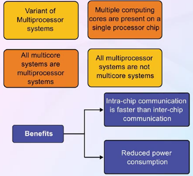

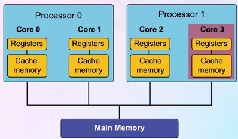

**Multicore systems** include multiple computing cores on a single chip, each core appearing as a separate processor to the OS.

**Advantages:**
- More efficient than multiple chips with single cores
- On-chip communication is faster
- Less power consumption than multiple single-core chips
- Better performance per watt

**Challenges:**
- **Parallelism**: Dividing activities into separate parallel tasks
- **Load balancing**: Distributing work evenly across cores
- **Data sharing**: Managing shared data between cores
- **Thread synchronization**: Coordinating concurrent threads

### Clustered Systems

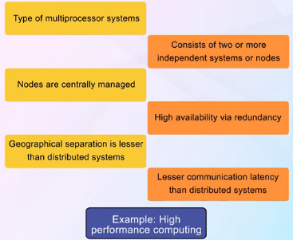

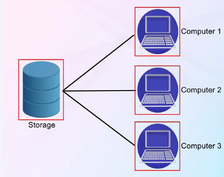

**Clustered systems** couple two or more individual systems (nodes) together to provide high availability and high performance.

**Types:**
- **Asymmetric clustering**: One machine in hot-standby mode monitoring active server
- **Symmetric clustering**: Multiple nodes running applications, monitoring each other

**Features:**
- **High availability**: Service continues if one or more systems fail
- **Storage area network (SAN)**: Shared storage across cluster
- **Distributed lock manager (DLM)**: Coordinates access to shared data
- **Scalability**: Can add more nodes for increased performance

**Applications:**
- High-performance computing (HPC)
- Database servers
- Web servers
- Scientific computations

---

## Distributed Systems

### Client-Server Systems

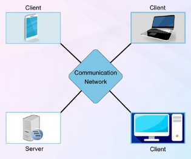

**Client-Server model** divides computing into two distinct types of systems:

**Server systems:**
- Provide services (compute, file, print, database)
- More powerful hardware
- Centralized resource management

**Client systems:**
- Request services from servers
- User interface and application logic
- Can be thin or fat clients

**Advantages:**
- Centralized control
- Resource sharing
- Scalability
- Specialized servers

### Peer-to-Peer Systems (P2P)

**P2P systems** are distributed systems where all nodes are equal peers - each node can act as both client and server.

**Characteristics:**
- No centralized coordination
- Each peer provides and consumes services
- Self-organizing network
- Discovery protocols for finding resources

**Types:**
- **Centralized directory**: Central server maintains index (e.g., Napster)
- **Fully distributed**: No central coordination (e.g., Gnutella, BitTorrent)
- **Hybrid**: Combination of both approaches

**Advantages:**
- No single point of failure
- Scalable architecture
- Resource sharing
- Cost-effective

**Challenges:**
- Security concerns
- Quality of service
- Resource discovery
- Data consistency

---

## Summary

Operating systems serve as the interface between users and hardware, managing resources and providing essential services. Key concepts include:

- **Resource Management**: CPU, memory, storage, and I/O devices
- **Protection Mechanisms**: Dual-mode operation, memory protection, access control
- **System Organization**: Interrupt-driven architecture, device management
- **System Types**: From simple single-processor to complex distributed systems
- **Process Management**: Scheduling, synchronization, communication
- **Storage Hierarchy**: Balancing speed, cost, and capacity

Modern operating systems employ sophisticated techniques like multiprogramming, multitasking, and multiprocessing to maximize efficiency and provide responsive, reliable computing environments.

---

*Notes based on "Operating System Concepts" by Abraham Silberschatz, Peter B. Galvin, and Greg Gagne*