# PROCESS

- A **process** is a program in execution.
- A program is a passive entity (executable file on disk), while a process is an active entity.
- A process includes:
  - **Text section**: The program code
  - **Program counter**: Current activity
  - **Stack**: Temporary data (function parameters, return addresses, local variables)
  - **Data section**: Global variables
  - **Heap**: Dynamically allocated memory during runtime

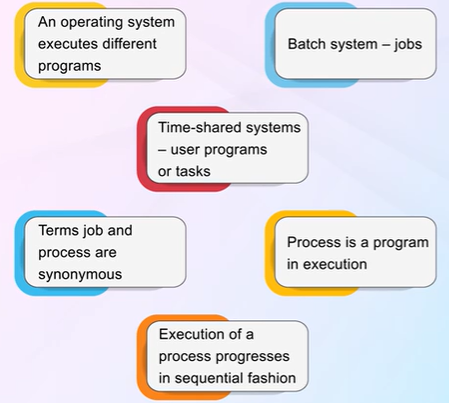

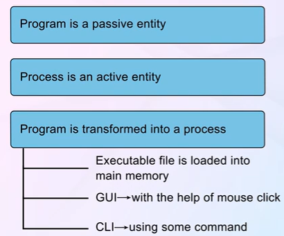

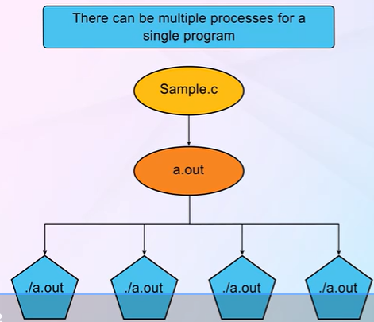

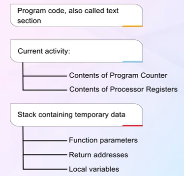

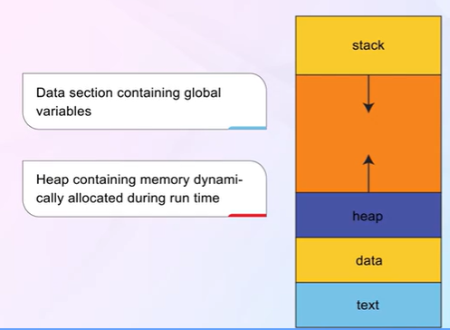

---

# STATES OF PROCESS

A process transitions through various states during its lifetime:

1. **New**: Process is being created
2. **Ready**: Process is waiting to be assigned to a processor
3. **Running**: Instructions are being executed
4. **Waiting (Blocked)**: Process is waiting for some event (I/O completion, signal)
5. **Terminated**: Process has finished execution


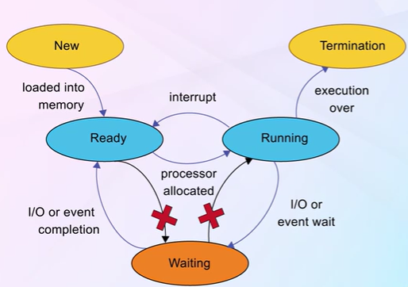

**Transitions:**
- **New → Ready**: Admitted to ready queue
- **Ready → Running**: Scheduler dispatch
- **Running → Ready**: Interrupt (time quantum expired)
- **Running → Waiting**: I/O or event wait
- **Waiting → Ready**: I/O or event completion
- **Running → Terminated**: Exit

---

# PCB

**Process Control Block (PCB)** - also called Task Control Block - contains information associated with each process:

- **Process state**: New, ready, running, waiting, terminated
- **Program counter**: Address of next instruction
- **CPU registers**: Accumulator, index registers, stack pointers
- **CPU scheduling information**: Priority, pointers to scheduling queues
- **Memory management information**: Base/limit registers, page tables
- **Accounting information**: CPU time used, time limits, process numbers
- **I/O status information**: List of I/O devices allocated, list of open files

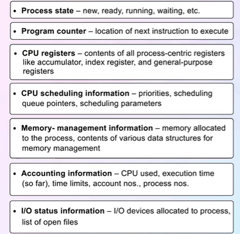

---

# FIRST PROCESS 

- In UNIX/Linux, the first process is called **init** (PID = 1).
- It is the ancestor of all other processes.
- Created by the kernel during boot.
- Responsible for starting system services and managing orphan processes.
- In modern Linux systems, **systemd** often replaces traditional init.

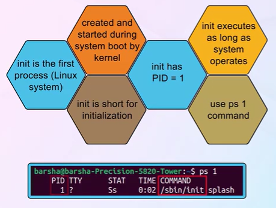

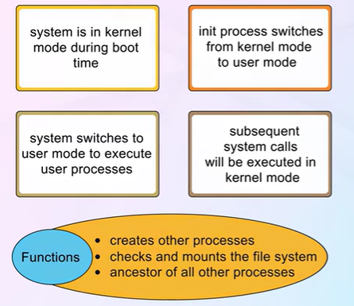

---

# PROCESS CONTEXT SWITCHING

- **Context switch**: When CPU switches from one process to another, the system must save the state of the old process and load the saved state of the new process.
- Context is represented in the PCB.
- Context-switch time is pure overhead (system does no useful work while switching).
- Time depends on hardware support (e.g., multiple register sets).

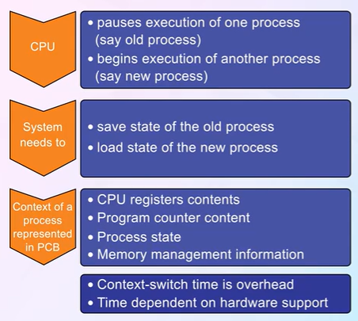

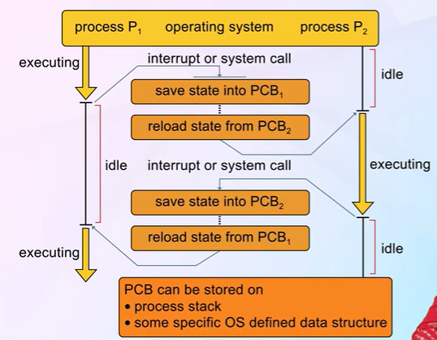

**Steps:**
1. Save state of currently running process in its PCB
2. Update PCB with new state (ready/waiting)
3. Move PCB to appropriate queue
4. Select new process from ready queue
5. Update PCB of new process to running state
6. Restore CPU context from new process's PCB

---

# PROCESS CREATION

- Processes are created using system calls (e.g., `fork()` in UNIX).
- Parent process creates child processes, forming a **process tree**.
- Process identified by unique **Process Identifier (PID)**.

**Resource sharing options:**
1. Parent and child share all resources
2. Child shares subset of parent's resources
3. Parent and child share no resources

**Execution options:**
1. Parent and child execute concurrently
2. Parent waits until child terminates

**Address space options:**
1. Child is duplicate of parent (same program and data)
2. Child has a new program loaded into it

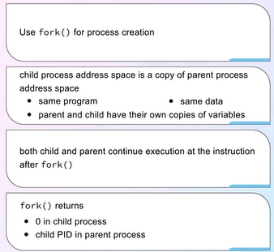

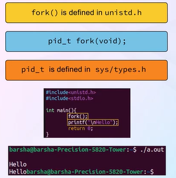

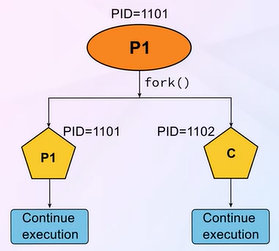

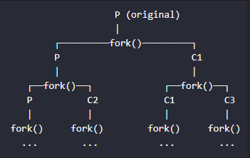

**UNIX Example:**
```c
pid_t pid = fork();  // Create new process
if (pid == 0) {
    // Child process
    execlp("/bin/ls", "ls", NULL);
} else if (pid > 0) {
    // Parent process
    wait(NULL);  // Wait for child
}
```

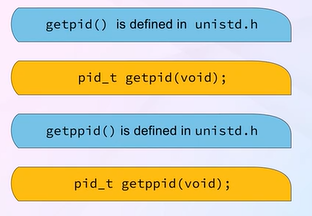


---

# POST PROCESS CREATION

After `fork()`:
- Child gets a copy of parent's address space
- Both processes continue execution from the instruction after `fork()`
- `fork()` returns:
  - **0** to the child process
  - **Child's PID** to the parent process
  - **-1** if fork fails

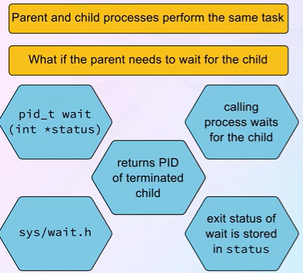

**Zombie Process**: A process that has completed execution but still has an entry in the process table (waiting for parent to read its exit status).

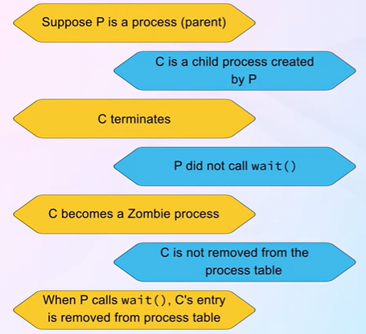

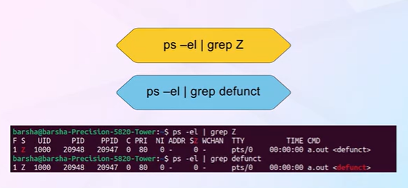

**Orphan Process**: A process whose parent has terminated. Orphans are adopted by the init process.

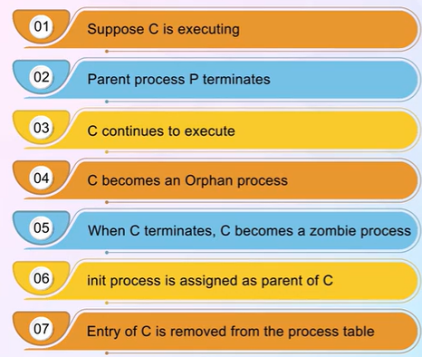

---

# PROCESS TERMINATION

- Process terminates when it finishes executing its final statement and asks the OS to delete it using `exit()`.
- Process can return a status value to its parent via `wait()`.
- All process resources are deallocated by OS.

**Parent may terminate child process using `abort()` when:**
1. Child has exceeded allocated resources
2. Task assigned to child is no longer required
3. Parent is exiting (cascading termination - some systems don't allow child to continue)

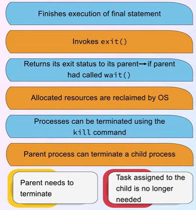

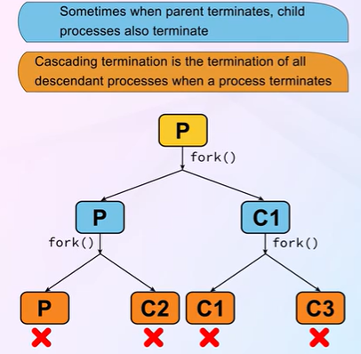

---

# BENEFITS OF IPC

**Inter-Process Communication (IPC)** allows processes to communicate and synchronize.

**Reasons for IPC:**
1. **Information sharing**: Multiple users may need same data
2. **Computation speedup**: Break task into subtasks (requires multiple CPUs)
3. **Modularity**: Divide system into separate processes/threads
4. **Convenience**: User may work on many tasks simultaneously

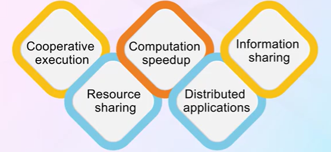

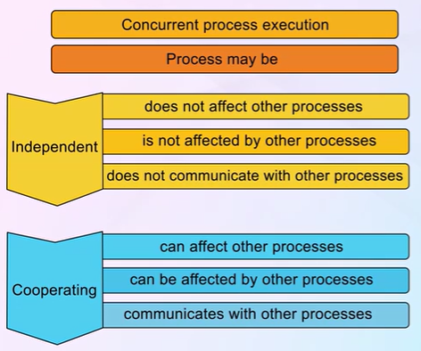

**Two fundamental models of IPC:**
1. Shared Memory
2. Message Passing

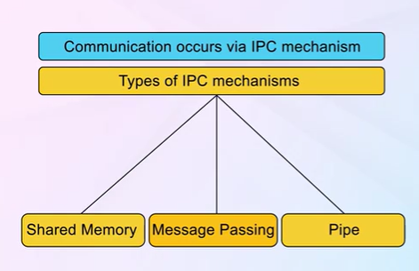

---

# SHARED MEMORY

- Region of memory shared between cooperating processes.
- Processes can exchange information by reading/writing to shared region.
- Faster than message passing (no kernel intervention after setup).
- Requires synchronization to prevent race conditions.

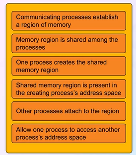

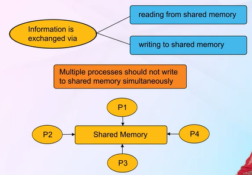

**Producer-Consumer Problem:**
- **Producer**: Produces information (e.g., compiler producing assembly code)
- **Consumer**: Consumes information (e.g., assembler)
- **Buffer**: Shared memory region
  - **Unbounded buffer**: No limit on buffer size
  - **Bounded buffer**: Fixed buffer size

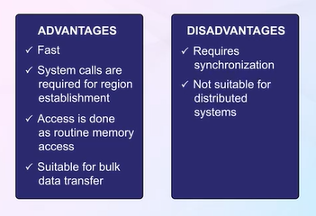

---

# MESSAGE PASSING

- Mechanism for processes to communicate and synchronize without sharing address space.
- Useful in distributed systems (processes on different computers).
- Implemented via system calls: `send(message)` and `receive(message)`.

**Communication link requirements:**
- Establish link between processes
- Exchange messages via send/receive

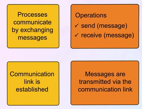

**Direct Communication:**
- Processes name each other explicitly
- `send(P, message)` - send to process P
- `receive(Q, message)` - receive from process Q
- Link established automatically between communicating pair


**Indirect Communication:**
- Messages sent/received through **mailboxes** (ports)
- `send(A, message)` - send to mailbox A
- `receive(A, message)` - receive from mailbox A
- Link established if processes share a mailbox
- Mailbox can be owned by process or OS

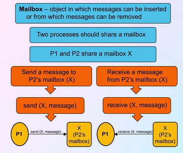

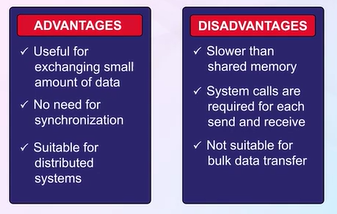

**Synchronization:**
- **Blocking (synchronous)**: Sender blocks until received; receiver blocks until message available
- **Non-blocking (asynchronous)**: Sender sends and continues; receiver gets valid message or null

---

# MESSAGE QUEUE - DATA STRUCTURE USED IN MESSAGE PASSING

- Messages exchanged between processes reside temporarily in a **message queue**.
- Queue can be:
  - **Zero capacity**: No buffering; sender must wait (rendezvous)
  - **Bounded capacity**: Finite length n; sender waits if queue full
  - **Unbounded capacity**: Infinite length; sender never waits

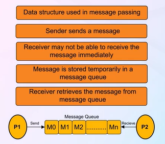

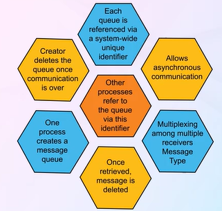

---

# PIPE

- A **pipe** acts as a conduit for communication between processes.
- One of the earliest IPC mechanisms in UNIX.

**Issues to consider:**
1. Unidirectional or bidirectional?
2. Half-duplex or full-duplex?
3. Must relationship (parent-child) exist?
4. Can pipes communicate over a network?

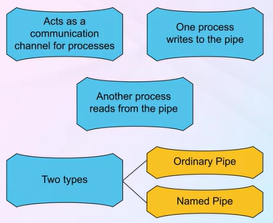

**Ordinary (Anonymous) Pipes:**
- Unidirectional communication
- One end for writing, one for reading
- Requires parent-child relationship
- Cannot be accessed from outside the process that created it

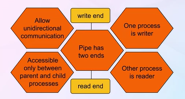

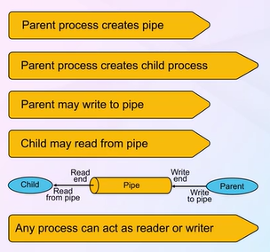

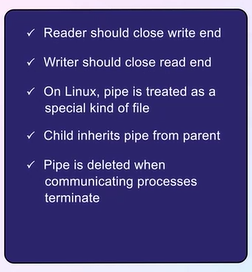

**Named Pipes (FIFOs):**
- More powerful than ordinary pipes
- Bidirectional communication
- No parent-child relationship required
- Several processes can use the same pipe
- Continue to exist after communicating processes have finished

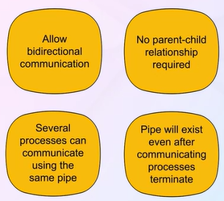

---

# JOB QUEUE

- Set of **all processes** in the system.
- When a process enters the system, it's placed in the job queue.
- Contains processes in any state (new, ready, waiting, running, terminated).

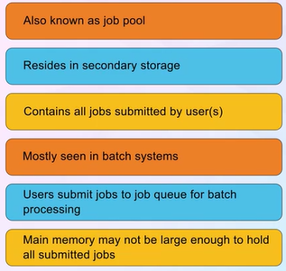

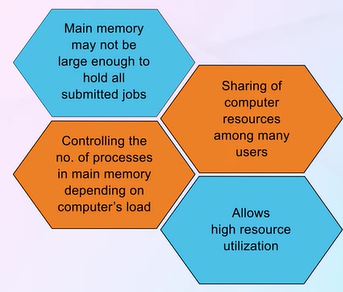

---

# READY QUEUE

- Set of all processes residing in **main memory**, ready and waiting to execute.
- Stored as a linked list.
- Ready queue header contains pointers to first and last PCBs.
- Each PCB includes a pointer to next PCB in ready queue.

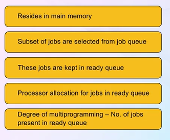

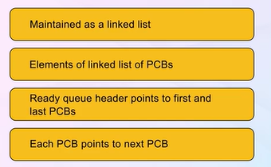

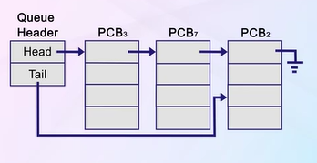

---

# DEVICE QUEUE

- Set of processes **waiting for a particular I/O device**.
- Each device has its own device queue.
- Process moves from ready queue to device queue when it requests I/O.
- After I/O completion, process returns to ready queue.

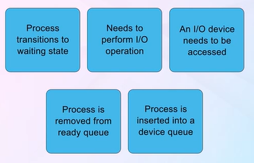

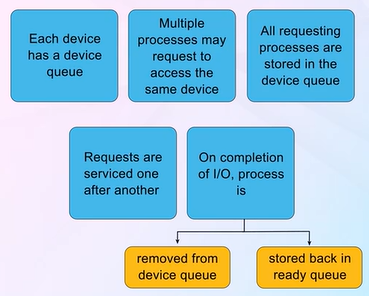

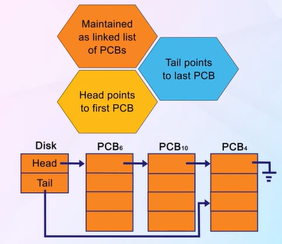

---

# TYPES OF PROCESSES

**I/O-Bound Process:**
- Spends more time doing I/O than computations
- Many short CPU bursts
- Example: Text editor, file copy

**CPU-Bound Process:**
- Spends more time doing computations
- Few very long CPU bursts
- Example: Scientific calculations, video encoding

**Note:** A good process mix includes both I/O-bound and CPU-bound processes for efficient CPU and device utilization.

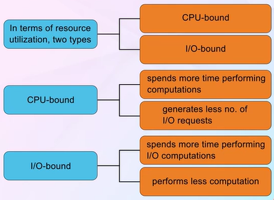

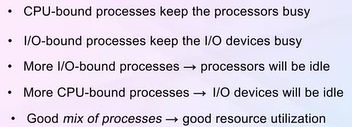

---

# SCHEDULERS

**Long-Term Scheduler (Job Scheduler):**
- Selects processes from job pool to bring into ready queue (memory)
- Controls degree of multiprogramming
- Invoked infrequently (seconds, minutes)
- Should select good mix of I/O-bound and CPU-bound processes

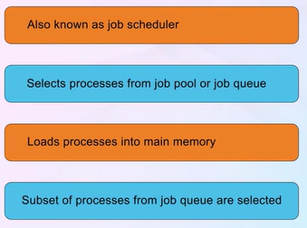

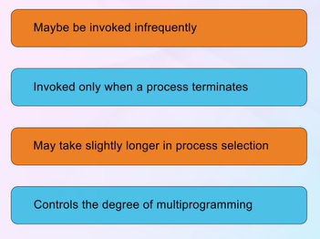

**Short-Term Scheduler (CPU Scheduler):**
- Selects from ready queue which process to execute next
- Invoked very frequently (milliseconds)
- Must be fast (context switch overhead)


**Medium-Term Scheduler:**
- Removes processes from memory (swapping)
- Reduces degree of multiprogramming
- Process swapped out, then swapped back in to continue execution
- Helps manage memory and process mix


---

# SCHEDULING QUEUES

**Queueing Diagram representation:**
- Rectangles: Queues (ready queue, device queues)
- Circles: Resources serving queues
- Arrows: Flow of processes

**Process lifecycle through queues:**
1. New process → Job queue → Ready queue
2. Dispatched → Running
3. If I/O request → Device queue → Ready queue (after I/O)
4. If time quantum expires → Ready queue
5. If fork → Create child → Ready queue
6. If wait for event → Event queue → Ready queue (after event)
7. Terminate → Exit

---

# SUMMARY

| Concept | Key Point |
|---------|-----------|
| Process | Program in execution with its own memory space |
| States | New, Ready, Running, Waiting, Terminated |
| PCB | Data structure containing all process information |
| Context Switch | Saving/restoring process state during CPU switch |
| fork() | Creates new process as copy of parent |
| IPC | Communication between processes (shared memory/message passing) |
| Pipe | Unidirectional conduit for parent-child communication |
| Schedulers | Long-term (jobs), Short-term (CPU), Medium-term (swapping) |