# Operating System Structures

## Table of Contents
1. [Operating System Interfaces](#operating-system-interfaces)
2. [System Calls](#system-calls)
3. [Kernel Architectures](#kernel-architectures)
4. [System Boot Process](#system-boot-process)
5. [Common Commands](#common-commands)

---

## Operating System Interfaces

### Types of Interfaces

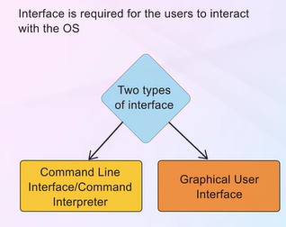

Operating systems provide interfaces for users and programs to interact with system resources:

**1. Command-Line Interface (CLI)**
- Text-based interface for system interaction
- Shell programs interpret user commands
- Examples: bash, zsh, PowerShell, cmd

**2. Graphical User Interface (GUI)**
- Visual interface with windows, icons, menus
- Mouse and keyboard interaction
- User-friendly for general users

**3. Touchscreen Interface**
- Direct manipulation through touch gestures
- Common in mobile devices and tablets

**4. Batch Interface**
- Commands stored in files and executed sequentially
- No user interaction during execution

### Command Line Interface (CLI)

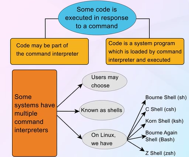

**Characteristics:**
- CLI may or may not be part of the kernel
- Shell programs act as command interpreters
- Two approaches:
  - **Built-in commands**: Commands implemented within the shell
  - **System programs**: Shell loads and executes separate programs

**Advantages:**
- Powerful and flexible
- Scriptable and automatable
- Efficient for experienced users
- Remote access friendly

**Common Shell Types:**
- Bourne Shell (sh)
- C Shell (csh)
- Bourne-Again Shell (bash)
- Korn Shell (ksh)

---

## System Calls

### What are System Calls?

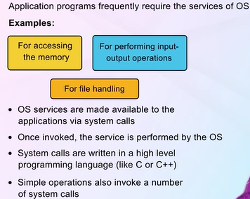

**System calls** provide the interface between a running program and the operating system. They are the means by which a user program requests services from the OS kernel.

**Key Points:**
- Only way to access kernel services
- Transition from user mode to kernel mode
- Typically invoked through high-level APIs
- Different for each operating system

### System Call Examples


Common system call categories:
- **Process control**: create, terminate, load, execute
- **File management**: create, delete, open, close, read, write
- **Device management**: request, release, read, write
- **Information maintenance**: get/set time, system data
- **Communications**: create connections, send/receive messages
- **Protection**: get/set permissions

### System Call Invocation


**Process:**
1. Application makes API call
2. API function prepares system call
3. Trap to kernel mode (software interrupt)
4. Kernel identifies system call via system call number
5. System call handler executes in kernel
6. Return to user mode with result

**Mechanisms:**
- Parameters passed via registers, stack, or memory blocks
- System call number identifies which service is requested
- Trap instruction switches to kernel mode
- Return-from-trap restores user mode

### Application Programming Interface (API)

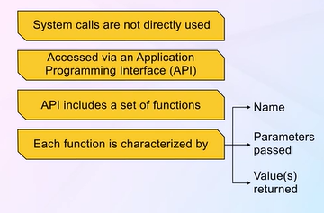


**API** is a set of functions available to programmers for accessing OS services, providing abstraction over system calls.

**Common APIs:**
- **POSIX API**: Unix, Linux, Mac OS X
- **Win32 API**: Windows systems
- **Java API**: Java Virtual Machine

**Benefits:**
- **Portability**: Programs can run on any system supporting the API
- **Ease of use**: Simpler than direct system calls
- **Abstraction**: Hides system-specific details
- **Stability**: API remains consistent even if system calls change

### System Call Categories

#### Process Management System Calls

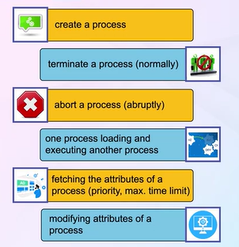

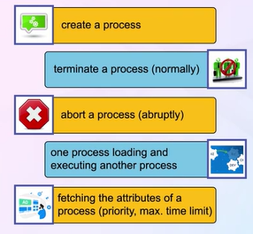

**Key system calls:**
- `fork()`: Create new process
- `exec()`: Execute a program
- `wait()`: Wait for child process
- `exit()`: Terminate process
- `getpid()`: Get process ID
- `nice()`: Change process priority
- `kill()`: Send signal to process

#### File Management System Calls


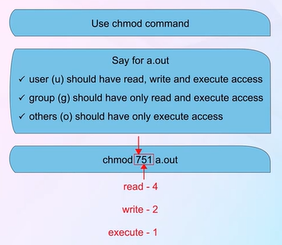

**Key system calls:**
- `open()`: Open file
- `close()`: Close file
- `read()`: Read from file
- `write()`: Write to file
- `lseek()`: Reposition file offset
- `stat()`: Get file status
- `chmod()`: Change file permissions
- `unlink()`: Delete file

**File Permissions (Unix/Linux):**
- **Owner**: User who owns the file (rwx)
- **Group**: Users in the file's group (rwx)
- **Others**: All other users (rwx)
- **r**: read (4), **w**: write (2), **x**: execute (1)

#### Device Management System Calls


**Key system calls:**
- `ioctl()`: Device-specific operations
- `read()`: Read from device
- `write()`: Write to device
- `open()`: Request device access
- `close()`: Release device

**Concepts:**
- Devices treated as special files
- Device drivers handle hardware-specific operations
- Unified interface for all I/O devices

#### Miscellaneous System Calls

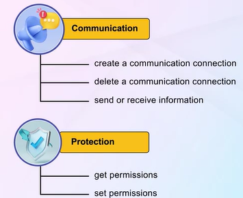

**Information Maintenance:**
- `getpid()`, `getuid()`: Get process/user ID
- `time()`, `gettimeofday()`: Get current time
- `sysinfo()`: Get system information

**Communication:**
- `pipe()`: Create communication channel
- `socket()`: Create network endpoint
- `send()`, `recv()`: Network communication

**Protection:**
- `chmod()`: Change file permissions
- `chown()`: Change file owner
- `setuid()`: Set user ID

---

## Kernel Architectures

### Monolithic Kernels


**Structure:**
- All OS services run in kernel space
- Single large process with all kernel functionality
- Direct function calls between components
- No message passing overhead

**Characteristics:**
- Entire OS in kernel mode
- Tightly integrated components
- Fast performance (no context switching)
- Examples: Traditional Unix, Linux (mostly), MS-DOS

**Advantages:**
- **High performance**: Direct function calls, no IPC overhead
- **Efficient**: Shared data structures, fast communication
- **Simple communication**: Components directly call each other

**Disadvantages:**
- **Large size**: Entire OS in kernel
- **Hard to maintain**: Tightly coupled code
- **Less secure**: Bug in any component can crash system
- **Difficult to debug**: Complex interdependencies
- **Not modular**: Changes affect entire kernel

### Layered Kernels


**Structure:**
- OS divided into hierarchical layers
- Each layer uses services of lower layers only
- Layer N uses services of layer N-1
- Bottom layer (Layer 0) is hardware

**Example Layering:**
- **Layer 0**: Hardware
- **Layer 1**: CPU scheduling
- **Layer 2**: Memory management
- **Layer 3**: Inter-process communication
- **Layer 4**: I/O devices
- **Layer 5**: User programs

**Advantages:**
- **Modularity**: Clear separation of concerns
- **Easy debugging**: Test each layer independently
- **Information hiding**: Each layer hides implementation details
- **Easy to construct**: Build and verify layer by layer

**Disadvantages:**
- **Performance overhead**: Multiple layer traversals
- **Difficult to define layers**: Circular dependencies
- **Less efficient**: More function calls than monolithic
- **Rigid structure**: Hard to change layer definitions

### Microkernels


**Structure:**
- Minimal kernel with only essential services
- Most services run in user space as servers
- Communication via message passing (IPC)
- Kernel provides: IPC, basic memory management, CPU scheduling

**Services in User Space:**
- Device drivers
- File systems
- Virtual memory manager
- Networking protocols

**Characteristics:**
- Small kernel footprint
- Services as separate processes
- Message-based communication
- Examples: Mach, L4, QNX, MINIX 3

**Advantages:**
- **Reliability**: Failure in service doesn't crash kernel
- **Security**: Services isolated with limited privileges
- **Flexibility**: Easy to add/remove services
- **Portability**: Less hardware-dependent code in kernel
- **Distributed systems**: Natural message-passing model
- **Easy to extend**: Add services without kernel modification

**Disadvantages:**
- **Performance overhead**: Message passing slower than function calls
- **Complexity**: More IPC required
- **System call overhead**: More context switches

### Loadable Kernel Modules (LKM)


**Structure:**
- Core kernel with minimal functionality
- Modules loaded dynamically as needed
- Modules run in kernel space
- Best features of monolithic and microkernel approaches

**Characteristics:**
- **Dynamic loading**: Load modules at runtime without reboot
- **Kernel space execution**: Modules run in kernel mode
- **Flexible**: Load only needed functionality
- **Examples**: Linux, Solaris, macOS

**Module Types:**
- Device drivers
- File systems
- System calls
- Network protocols
- Executable interpreters

**Advantages:**
- **Flexibility**: Load/unload modules as needed
- **Small kernel**: Core kernel remains small
- **No reboot required**: Dynamic module loading
- **Performance**: Similar to monolithic (no message passing)
- **Maintainability**: Modules developed independently

**Comparison:**
- **vs. Monolithic**: More flexible, smaller core
- **vs. Microkernel**: Better performance, runs in kernel space
- **vs. Layered**: More flexible, dynamic loading

### Hybrid Kernels

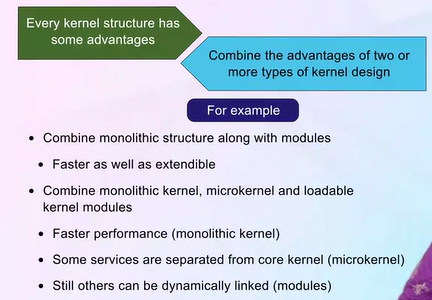

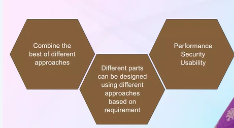

**Structure:**
- Combines microkernel and monolithic approaches
- Core services in kernel space for performance
- Non-essential services can run in user space
- Pragmatic compromise between designs

**Characteristics:**
- Microkernel-like structure with monolithic performance
- Some services in kernel, others in user space
- Message passing and function calls both used
- Examples: Windows NT/XP/7/10, macOS (XNU kernel)

**Design Philosophy:**
- Keep performance-critical code in kernel
- Move less critical services to user space
- Balance between performance and modularity

**Advantages:**
- **Performance**: Critical services in kernel space
- **Modularity**: Non-critical services isolated
- **Flexibility**: Can move services between kernel/user space
- **Practical**: Best of both worlds

**Disadvantages:**
- **Complexity**: More complex than pure designs
- **Design decisions**: Determining what goes where
- **Not pure**: Compromises theoretical elegance

---

## System Boot Process

### BIOS (Basic Input/Output System)

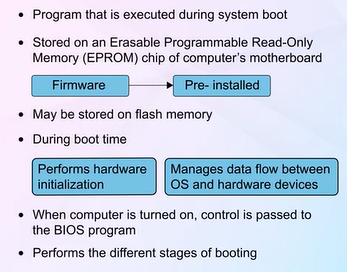

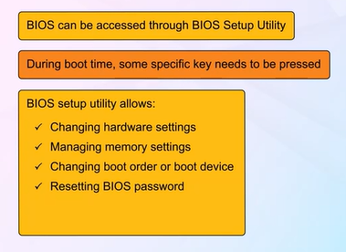

**BIOS** is firmware that initializes hardware during boot process before OS loads.

**Functions:**
- Hardware initialization
- Power-On Self Test (POST)
- Boot device selection
- Load bootloader from boot device
- Provide runtime services for OS and programs

**Characteristics:**
- Stored in non-volatile ROM/Flash memory on motherboard
- First software that runs when computer starts
- Platform-specific (x86 BIOS, UEFI)

**BIOS Settings:**
- Boot order configuration
- Hardware configuration (CPU, memory, drives)
- System time and date
- Security settings (passwords, secure boot)
- Power management options

**Modern Alternative:**
- **UEFI (Unified Extensible Firmware Interface)**: Modern replacement for BIOS
  - Faster boot times
  - Larger disk support (>2TB)
  - Secure boot features
  - Better interface

### POST (Power-On Self Test)


**POST** is a diagnostic testing sequence run by BIOS to verify hardware is functioning correctly.

**Process:**
1. **CPU verification**: Check if CPU is functioning
2. **BIOS checksum**: Verify BIOS integrity
3. **Timer test**: Check system timer
4. **Memory test**: Test RAM functionality
5. **Keyboard test**: Check keyboard controller
6. **Drive detection**: Identify storage devices
7. **Video card test**: Initialize graphics

**POST Beep Codes:**
- 1 beep: Success, system OK
- 2 beeps: POST error (see screen for details)
- Continuous beeps: Memory or video card error
- No beeps: Power supply or motherboard failure

**Error Handling:**
- Fatal errors: System halts, displays error code
- Non-fatal errors: Warning displayed, boot continues
- POST card: External diagnostic tool for debugging

### Stages of Booting


**Boot Process:**

**Stage 1: Firmware (BIOS/UEFI)**
1. Power on
2. Execute BIOS/UEFI code from ROM
3. Run POST (Power-On Self Test)
4. Initialize hardware
5. Read MBR (Master Boot Record) from boot device

**Stage 2: Bootloader (GRUB, LILO, etc.)**
1. First-stage bootloader loaded from MBR(Master Boot Record, first sector (512 bytes) on the bootable storage device)
2. Second-stage bootloader loaded (if needed)
3. Display boot menu (if multiple OS)
4. Load kernel into memory
5. Pass control to kernel with boot parameters

**GRUB (Grand Unified Bootloader):**
- Most common Linux bootloader
- Supports multiple operating systems
- Interactive command-line interface
- Configuration file: `/boot/grub/grub.cfg`

**Stage 3: Kernel**
1. Kernel decompresses itself
2. Initialize hardware (CPU, memory, devices)
3. Mount root filesystem
4. Start init process (PID 1)

**Stage 4: Init System (systemd/init)**
1. Init process (PID 1) starts
2. Read configuration files
3. Mount additional filesystems
4. Start system services (daemons)
5. Launch login prompts/GUI

**Modern Init Systems:**
- **systemd**: Modern, parallel service startup (most Linux distributions)
- **SysVinit**: Traditional sequential startup
- **Upstart**: Event-based (Ubuntu, older versions)

**Boot Parameters:**
- Kernel command-line options
- Root filesystem location
- Init system to use
- Debug options

---

## Common Commands

### Process Management Commands

**Viewing Processes:**

```bash
# Display all processes with details
ps -el

# Dynamic list of processes (updates in real-time)
top

# Hierarchical view of processes
pstree
# Note: Parent of all processes is systemd (or init) with PID 1
```

**Process Control:**

```bash
# Terminate a process
kill <pid>

# Send specific signal to process
kill -SIGNAL <pid>
# Common signals: SIGTERM (15), SIGKILL (9), SIGHUP (1)

# View process by name
pgrep <process_name>

# Kill process by name
pkill <process_name>

# Change process priority
nice -n <priority> <command>
renice <priority> -p <pid>
```

**Process Information:**
- `ps aux`: All processes with user info
- `ps -ef`: Full-format listing
- `htop`: Interactive process viewer (better than top)
- `pidof`: Find PID of running program

### Search Commands

**grep - Pattern Searching:**

```bash
# Search for pattern in file
grep "pattern" file.txt

# Case-insensitive search
grep -i "pattern" file.txt

# Recursive search in directory
grep -r "pattern" /path/to/dir

# Show line numbers
grep -n "pattern" file.txt

# Invert match (lines NOT containing pattern)
grep -v "pattern" file.txt
```

**ls - List Directory Contents:**

```bash
# Basic listing
ls

# Long format with details
ls -l

# Include hidden files
ls -a

# Human-readable sizes
ls -lh

# Sort by modification time
ls -lt

# Recursive listing
ls -R
```

**Note**: `ls` is limited to current directory scope (or specified directory)

**find - System-wide File Search:**

```bash
# Find by name
find /path -name "filename"

# Find by type (f=file, d=directory)
find /path -type f

# Find by size
find /path -size +100M

# Find and execute command
find /path -name "*.log" -exec rm {} \;

# Find by modification time
find /path -mtime -7  # Modified in last 7 days

# Find by permissions
find /path -perm 755
```

**Note**: `find` searches at whole system level (depending on path specified)

**Other Useful Search Commands:**

```bash
# Locate files using database (faster than find)
locate filename

# Which - find executable in PATH
which command

# Whereis - locate binary, source, and manual
whereis command
```

---

## Summary

Operating system structures define how OS components are organized and interact:

**Key Concepts:**

1. **Interfaces**: CLI, GUI provide user interaction with OS
2. **System Calls**: Essential interface between user programs and kernel
3. **APIs**: Abstract system calls for portability and ease of use
4. **Kernel Architectures**: Different design philosophies
   - Monolithic: Performance, complexity
   - Layered: Modularity, structure
   - Microkernel: Reliability, flexibility
   - Loadable Modules: Flexibility, performance
   - Hybrid: Pragmatic compromise

5. **Boot Process**: BIOS → Bootloader → Kernel → Init System
6. **System Management**: Commands for process, file, and device management

**Design Tradeoffs:**
- Performance vs. Modularity
- Simplicity vs. Flexibility
- Security vs. Efficiency
- Monolithic vs. Microkernel

Modern operating systems typically use hybrid approaches with loadable kernel modules, combining the best features of different architectures.

---

*Notes based on "Operating System Concepts" by Abraham Silberschatz, Peter B. Galvin, and Greg Gagne*