# THREADS

A **thread** is the basic unit of CPU utilization. It comprises a *thread ID*, a *program counter (PC)*, a *register set*, and a *stack*. Threads belonging to the same process share the code section, data section, and other operating-system resources such as open files and signals.

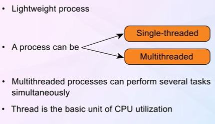

A traditional (or **heavyweight**) process has a single thread of control. If a process has multiple threads of control, it can perform more than one task at a time.

---

# THREAD's WEIGHT

Threads are often called **lightweight processes (LWP)** because they share most of the resources with other threads in the same process, unlike processes which have their own separate memory space.

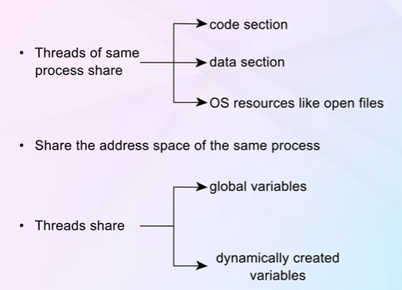

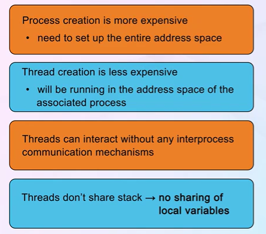

### Thread vs Process Context Switch

Context switching between threads of the same process is significantly **faster** than switching between processes because:
- Threads share the same address space (no need to switch page tables)
- Threads share code, data, and heap sections
- Only thread-specific data (registers, stack, PC) needs to be saved/restored

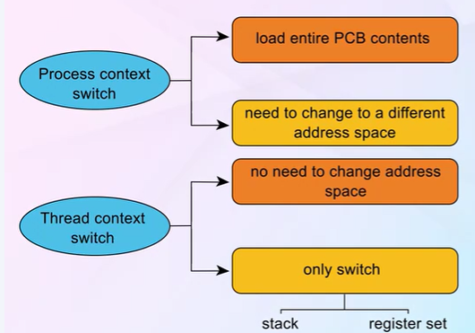

| Aspect | Thread Context Switch | Process Context Switch |
|--------|----------------------|------------------------|
| **Memory Management** | No change to address space | Full address space switch required |
| **Cache State** | Often preserved (same process) | Usually invalidated (TLB flush) |
| **Resources Shared** | Code, data, heap, files | Nothing shared by default |
| **Speed** | Fast (microseconds) | Slower (more overhead) |
| **What's Saved** | Registers, PC, stack pointer | Everything + memory mappings |

---

# MOTIVATION OF MULTITHREADING

Modern applications are increasingly **multithreaded**. Multiple tasks within an application can be implemented by separate threads:
- Update display
- Fetch data
- Spell checking
- Answer network requests

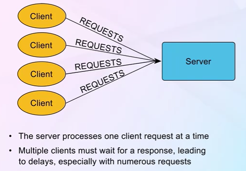

**Key Motivations:**
- Most modern operating system **kernels are multithreaded** - several threads operate in the kernel, each performing a specific task
- Process creation is **heavyweight** while thread creation is **lightweight**
- Threads can simplify code and increase efficiency
- Kernels are generally multithreaded to handle device drivers, virtual memory management, and interrupt handling

---

# BENEFITS OF MULTITHREADING

There are four major categories of benefits:

### 1. Responsiveness
Multithreading allows a program to continue running even if part of it is blocked or performing a lengthy operation. This is especially important for **user interfaces**.

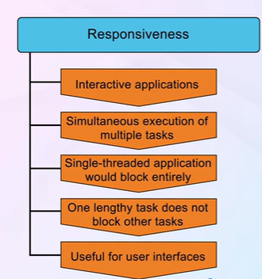

### 2. Resource Sharing
Threads share the memory and resources of the process to which they belong by default. The benefit of sharing code and data is that it allows an application to have several different threads of activity within the **same address space**.


### 3. Economy
Allocating memory and resources for process creation is **costly**. Because threads share resources of the process to which they belong, it is more economical to create and context-switch threads.

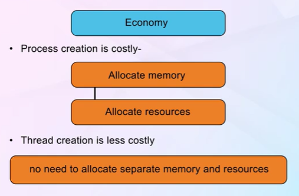

### 4. Scalability
The benefits of multithreading can be even greater in a multiprocessor architecture, where threads may be running in **parallel** on different processing cores.

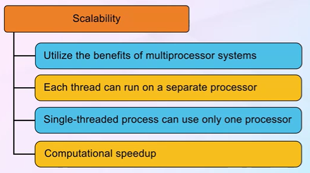

| Benefit | Description | Example |
|---------|-------------|---------|
| **Responsiveness** | UI remains responsive during long operations | Web browser loading page while user scrolls |
| **Resource Sharing** | Threads share code, data, and files | Multiple threads accessing same database connection pool |
| **Economy** | Lower overhead than process creation | Server handling multiple client requests |
| **Scalability** | Better utilization of multicore systems | Parallel processing of large datasets |

---

| Type of process | Can it use multiple cores simultaneously? | Explanation | Max cores it can use at once (typical modern system) |
| --- | --- | --- | --- |
| Single-threaded process (1 thread) | No | A single thread of execution can only run on one core at any given moment. The OS can move it between cores over time (migration), but never split it across cores simultaneously. | 1 core |
| Multi-threaded process (≥2 threads) | Yes | Each thread is an independent unit of execution. The OS scheduler can assign different threads of the same process to different cores at the same instant → true parallelism. | Up to the number of threads (or available cores / hyper-threads) |
| Single-threaded process + multiple processes running | Indirectly helps the system | Multiple single-threaded processes can be spread across cores, but each individual process still uses only one core at a time. | Still only 1 per process |

---

# MULTICORE PROGRAMMING

**Multicore systems** are systems in which multiple computing cores reside on a single processing chip. Each core appears as a separate processor to the operating system.

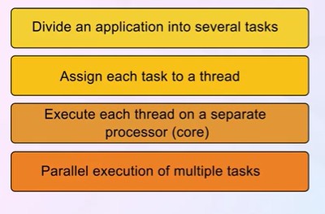

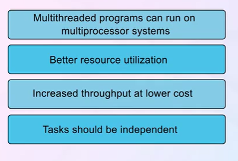

### Why Multicore Matters
- **Trend**: The trend in system design is to place multiple computing cores on a single chip
- **Efficiency**: More efficient use of multiple cores through multithreaded programming
- **Consider**: On a system with a single computing core, concurrency means execution of threads is *interleaved* over time
- **True Parallelism**: On a system with multiple cores, concurrency means threads can run in *parallel* (simultaneously)

---

# CHALLENGES OF MULTICORE PROGRAMMING

Writing multithreaded programs presents several challenges for programmers:

### 1. Dividing Activities
Examining applications to find areas that can be divided into separate, concurrent tasks. Ideally, tasks are **independent** of one another and thus can run in parallel on individual cores.

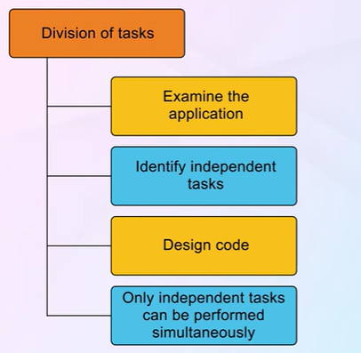

### 2. Balance
Ensuring that the tasks perform **equal work of equal value**. In some instances, a certain task may not contribute as much value to the overall process as others.

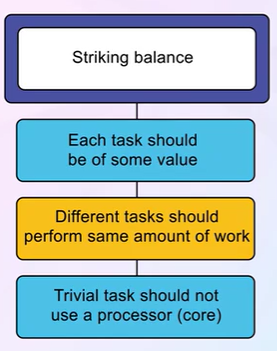

### 3. Data Splitting
Just as applications are divided into separate tasks, the **data accessed and manipulated** by the tasks must be divided to run on separate cores.

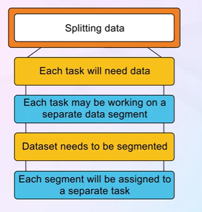

### 4. Data Dependency
The data accessed by the tasks must be examined for **dependencies** between two or more tasks. When one task depends on data from another, programmers must ensure that execution of tasks is **synchronized**.


### 5. Testing and Debugging
When a program runs in parallel on multiple cores, many **different execution paths** are possible. Testing and debugging such concurrent programs is inherently more difficult.

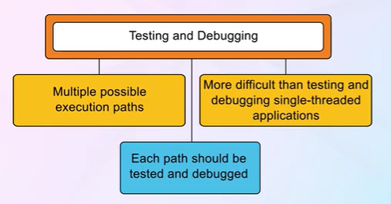

| Challenge | Description | Solution Approach |
|-----------|-------------|-------------------|
| **Dividing Activities** | Finding parallelizable tasks | Task decomposition analysis |
| **Balance** | Equal workload distribution | Load balancing algorithms |
| **Data Splitting** | Partitioning data for parallel access | Data decomposition strategies |
| **Data Dependency** | Managing shared data access | Synchronization primitives |
| **Testing & Debugging** | Multiple execution paths | Race condition detection tools |

---

# PARALLELISM VS CONCURRENCY

Understanding the distinction between **parallelism** and **concurrency** is fundamental:

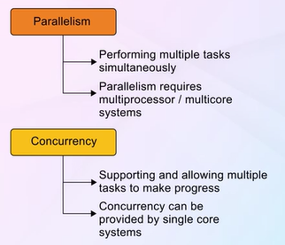


### Concurrency
- **Definition**: Supports more than one task making progress
- **Mechanism**: Uses time slicing on a single processor
- **Reality**: Tasks appear to progress simultaneously but actually interleave
- **Example**: Single-core system running multiple applications

### Parallelism
- **Definition**: Implies a system can perform more than one task simultaneously
- **Mechanism**: Requires multiple processing cores
- **Reality**: Tasks actually execute at the same time
- **Example**: Multi-core processor running threads on different cores

| Aspect | Concurrency | Parallelism |
|--------|-------------|-------------|
| **Hardware Required** | Single core sufficient | Multiple cores required |
| **Execution** | Interleaved | Simultaneous |
| **Goal** | Managing multiple tasks | Performing multiple tasks faster |
| **Illusion vs Reality** | Creates illusion of parallelism | True simultaneous execution |

---

# TYPES OF PARALLELISM

There are two main types of parallelism:

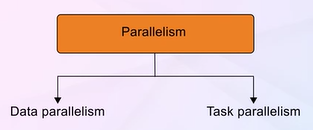

### 1. Data Parallelism
- Focuses on distributing **subsets of the same data** across multiple computing cores
- Performs the **same operation** on each subset
- *Example*: Summing elements of an array by dividing the array between cores

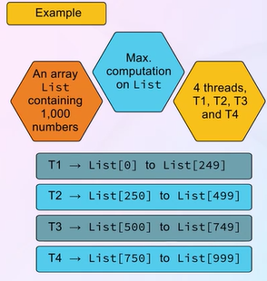

### 2. Task Parallelism
- Focuses on distributing **tasks (threads)** across multiple computing cores
- Each thread may be performing a **unique operation**
- Threads may operate on the same data or different data
- *Example*: Different threads performing different calculations on the same dataset

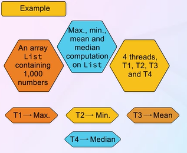

| Type | Focus | Data | Operations | Example |
|------|-------|------|------------|---------|
| **Data Parallelism** | Data distribution | Same data split across cores | Same operation on each piece | Array sum on 4 cores |
| **Task Parallelism** | Task distribution | Same or different data | Different operations | Producer-consumer pattern |

---

# USER VS KERNEL LEVEL THREADS

Threads may be provided at the **user level** (user threads) or by the **kernel** (kernel threads).

### User-Level Threads
- Managed by a **user-level thread library** without kernel support
- **Faster** to create and manage (no system calls)
- If one thread blocks, the **entire process blocks**
- Cannot take advantage of multiple processors
- *Examples*: POSIX Pthreads, Windows threads, Java threads (historical implementations)

### Kernel-Level Threads
- Supported and managed directly by the **operating system kernel**
- **Slower** to create and manage (requires system calls)
- If one thread blocks, the kernel can schedule another thread
- Can take advantage of **multiple processors**
- *Examples*: Windows, Linux, macOS kernel threads

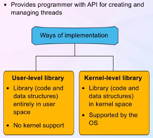

| Aspect | User-Level Threads | Kernel-Level Threads |
|--------|-------------------|---------------------|
| **Management** | Thread library | Operating system kernel |
| **Creation Speed** | Fast (no kernel involvement) | Slower (system call required) |
| **Blocking Behavior** | Entire process blocks | Only blocking thread waits |
| **Multiprocessor Utilization** | Cannot use multiple cores | Can use multiple cores |
| **Context Switch** | Very fast (user space) | Slower (kernel involvement) |
| **Scheduling** | Application-level | OS-level |

---

# MANY TO ONE MODEL

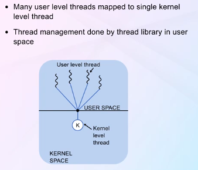

The **many-to-one model** maps many user-level threads to one kernel thread.

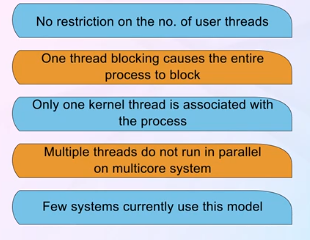

### Characteristics:
- Thread management is done by the **thread library** in user space, so it is efficient
- The entire process will block if a thread makes a **blocking system call**
- Only **one thread can access the kernel** at a time, so multiple threads are unable to run in parallel on multicore systems
- Few systems continue to use this model because of its inability to take advantage of multiple processing cores

### Advantages:
- Efficient thread management (no kernel involvement)
- Portable across different operating systems

### Disadvantages:
- Cannot utilize multiple processors
- Blocking system calls block entire process
- *Examples*: Solaris Green Threads, GNU Portable Threads

---

# ONE TO ONE MODEL

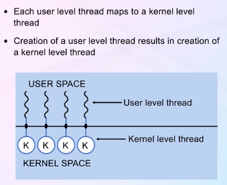

The **one-to-one model** maps each user thread to a kernel thread.

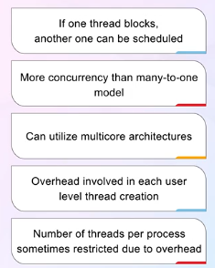

### Characteristics:
- Provides **more concurrency** than the many-to-one model by allowing another thread to run when a thread makes a blocking system call
- Allows multiple threads to run in **parallel on multiprocessors**
- The only **drawback** is that creating a user thread requires creating the corresponding kernel thread
- The overhead of creating kernel threads can burden the performance of an application

### Advantages:
- True parallelism on multiprocessor systems
- If one thread blocks, others can continue
- More responsive system behavior

### Disadvantages:
- Higher overhead for thread creation
- May limit number of threads supported
- *Examples*: Windows, Linux, macOS (modern implementations)

---

# MANY TO MANY MODEL


The **many-to-many model** multiplexes many user-level threads to a smaller or equal number of kernel threads.

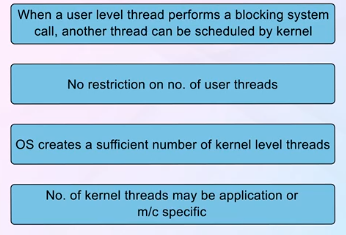

### Characteristics:
- Developers can create as many user threads as necessary
- The corresponding kernel threads can run in **parallel on a multiprocessor**
- When a thread performs a blocking system call, the kernel can schedule another thread for execution
- Provides the **best of both worlds**: efficiency of user-level threads and parallelism of kernel threads

### Two-Level Model (Variation):
- Similar to many-to-many but also allows a user thread to be **bound** to a kernel thread
- Provides more flexibility for applications requiring guaranteed response time

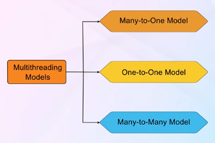

| Model | Mapping | Parallelism | Blocking Behavior | Overhead |
|-------|---------|-------------|-------------------|----------|
| **Many-to-One** | N user → 1 kernel | No | Process blocks | Low |
| **One-to-One** | 1 user → 1 kernel | Yes | Thread blocks | High |
| **Many-to-Many** | N user → M kernel | Yes | Thread blocks | Medium |

---

# THREAD RELATED DATA STRUCTURES

### Thread Control Block (TCB)

The **Thread Control Block (TCB)** is a data structure in the operating system kernel that contains information needed to manage a particular thread.

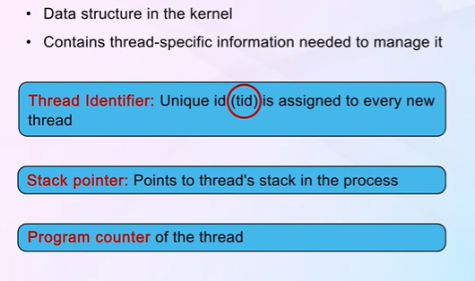

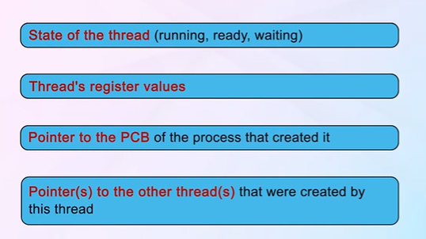

### Contents of TCB:
- **Thread ID**: Unique identifier for the thread
- **Thread State**: Running, ready, waiting, etc.
- **Program Counter**: Address of the next instruction
- **CPU Registers**: Contents of processor registers
- **Stack Pointer**: Pointer to the thread's stack
- **Priority**: Thread scheduling priority
- **Pointer to PCB**: Reference to the parent process

### Parts of a Thread

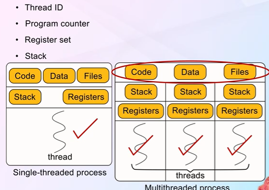

### Pthread Data Structures

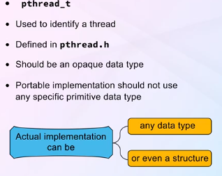

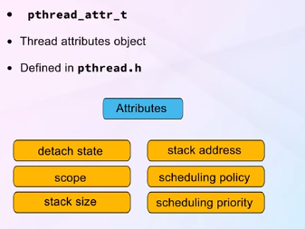

---

# THREAD FUNCTIONS

Thread libraries provide APIs for creating and managing threads. The most common thread library functions:

### POSIX Pthread Library

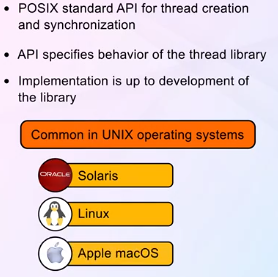

### Common Thread Functions:

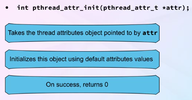

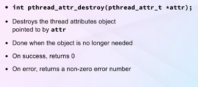

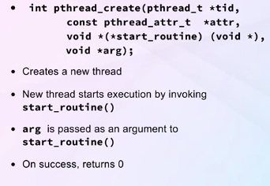

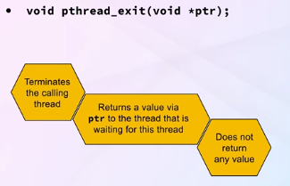

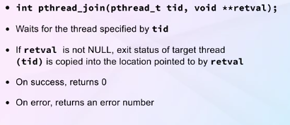

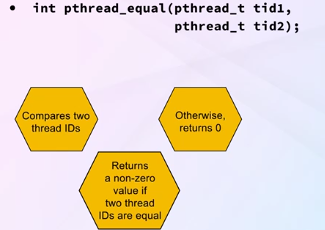

### Key Pthread Functions:

| Function | Description | Return Value |
|----------|-------------|--------------|
| `pthread_create()` | Creates a new thread | 0 on success, error code on failure |
| `pthread_join()` | Waits for a thread to terminate | 0 on success, error code on failure |
| `pthread_exit()` | Terminates the calling thread | Does not return |
| `pthread_self()` | Returns thread ID of calling thread | Thread ID |
| `pthread_detach()` | Marks thread as detached | 0 on success, error code on failure |
| `pthread_cancel()` | Requests cancellation of a thread | 0 on success, error code on failure |

### Example: Basic Thread Creation

```c
#include <pthread.h>
#include <stdio.h>

void *runner(void *param) {
    printf("Hello from thread!\n");
    pthread_exit(0);
}

int main() {
    pthread_t tid;
    pthread_attr_t attr;
    
    pthread_attr_init(&attr);
    pthread_create(&tid, &attr, runner, NULL);
    pthread_join(tid, NULL);
    
    return 0;
}
```

---

# EXAMPLE MULTITHREADED PROGRAM

A typical multithreaded program structure involves:

1. **Main thread** creates worker threads
2. **Worker threads** perform parallel tasks
3. **Main thread** waits for workers to complete (join)
4. **Results** are combined or processed

### Example: Parallel Sum Calculation

```c
#include <pthread.h>
#include <stdio.h>
#include <stdlib.h>

#define NUM_THREADS 4
#define ARRAY_SIZE 1000

int array[ARRAY_SIZE];
int partial_sums[NUM_THREADS];

void *sum_section(void *arg) {
    int thread_id = *(int *)arg;
    int start = thread_id * (ARRAY_SIZE / NUM_THREADS);
    int end = start + (ARRAY_SIZE / NUM_THREADS);
    
    partial_sums[thread_id] = 0;
    for (int i = start; i < end; i++) {
        partial_sums[thread_id] += array[i];
    }
    
    pthread_exit(0);
}

int main() {
    pthread_t threads[NUM_THREADS];
    int thread_ids[NUM_THREADS];
    
    // Initialize array
    for (int i = 0; i < ARRAY_SIZE; i++) {
        array[i] = i + 1;
    }
    
    // Create threads
    for (int i = 0; i < NUM_THREADS; i++) {
        thread_ids[i] = i;
        pthread_create(&threads[i], NULL, sum_section, &thread_ids[i]);
    }
    
    // Wait for threads to complete
    for (int i = 0; i < NUM_THREADS; i++) {
        pthread_join(threads[i], NULL);
    }
    
    // Combine results
    int total = 0;
    for (int i = 0; i < NUM_THREADS; i++) {
        total += partial_sums[i];
    }
    
    printf("Total sum: %d\n", total);
    return 0;
}
```

---

# SYNCHRONOUS AND ASYNCHRONOUS MULTITHREADING

### Synchronous Threading

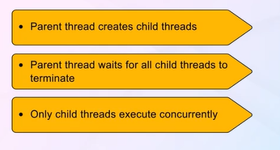


**Synchronous threading** (also called *fork-join* model):
- The parent thread creates one or more child threads
- The parent **waits** for all children to terminate before continuing
- Parent and children threads are **synchronized** at the join point
- Data sharing is relatively easy since parent waits for children

### Asynchronous Threading

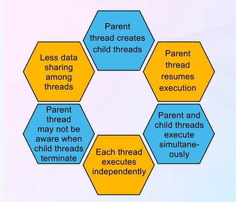

**Asynchronous threading**:
- The parent creates a child thread and **continues** executing
- Parent and child execute **concurrently** with little synchronization
- Each thread runs independently
- Useful for tasks that don't need immediate results
- More complex data sharing considerations

| Aspect | Synchronous Threading | Asynchronous Threading |
|--------|----------------------|------------------------|
| **Parent Behavior** | Waits for children | Continues execution |
| **Synchronization** | Implicit at join point | Explicit synchronization needed |
| **Data Sharing** | Easier (sequential access) | More complex (concurrent access) |
| **Use Case** | Divide-and-conquer algorithms | Event-driven systems |
| **Example** | Parallel merge sort | Web server handling requests |

---

# THREAD CANCELLATION

**Thread cancellation** is the task of terminating a thread before it has completed. A thread that is to be cancelled is often referred to as the **target thread**.


### Two General Approaches:

### 1. Asynchronous Cancellation

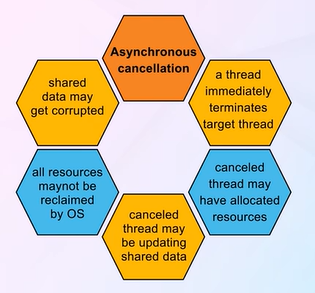

- One thread **immediately terminates** the target thread
- May leave shared data in an **inconsistent state**
- Resources may not be properly released
- **Dangerous** in practice—rarely used

### 2. Deferred Cancellation (Default)

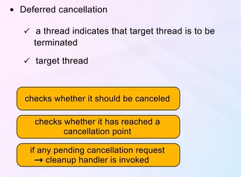

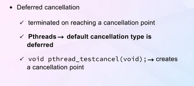

- Target thread **periodically checks** if it should be cancelled
- Allows the target to terminate itself in an **orderly fashion**
- Thread can check at **cancellation points** (safe points in execution)
- Thread has opportunity to **clean up resources** before terminating
- **Recommended** approach for thread cancellation

### Pthread Cancellation Functions:

```c
// Request cancellation of a thread
pthread_cancel(pthread_t thread);

// Set cancellation state
pthread_setcancelstate(int state, int *oldstate);
// state: PTHREAD_CANCEL_ENABLE or PTHREAD_CANCEL_DISABLE

// Set cancellation type
pthread_setcanceltype(int type, int *oldtype);
// type: PTHREAD_CANCEL_ASYNCHRONOUS or PTHREAD_CANCEL_DEFERRED

// Create a cancellation point
pthread_testcancel();
```

| Cancellation Type | When Cancelled | Safety | Resource Cleanup |
|-------------------|----------------|--------|------------------|
| **Asynchronous** | Immediately | Unsafe | May not occur |
| **Deferred** | At cancellation point | Safe | Guaranteed opportunity |

### Cancellation Points

Cancellation points are specific locations in code where a thread checks for pending cancellation requests. Common cancellation points include:
- `pthread_testcancel()`
- `pthread_join()`
- `pthread_cond_wait()`
- Most blocking system calls (`read()`, `write()`, `sleep()`)

---

# Summary

### Key Takeaways:

1. **Threads are lightweight execution units** that share process resources (code, data, files) while maintaining their own stack, registers, and program counter. This makes thread creation and context switching significantly faster than process operations.

2. **Multithreading provides four major benefits**: *Responsiveness* (UI remains active during long operations), *Resource Sharing* (threads naturally share address space), *Economy* (lower overhead than processes), and *Scalability* (better utilization of multicore processors).

3. **Parallelism vs Concurrency**: Concurrency is about *managing* multiple tasks (possible on single core), while parallelism is about *executing* multiple tasks simultaneously (requires multiple cores). Modern systems benefit from both.

4. **Thread models (Many-to-One, One-to-One, Many-to-Many)** represent different mappings between user and kernel threads, each with trade-offs between efficiency, parallelism support, and blocking behavior. The One-to-One model is most common in modern systems (Windows, Linux, macOS).

5. **Thread management requires careful consideration** of synchronization (how threads coordinate), cancellation (safe thread termination using deferred cancellation), and the challenges of multicore programming (dividing work, balancing load, managing data dependencies, and debugging concurrent code).

---

### Quick Reference Table

| Concept | Key Point |
|---------|-----------|
| **Thread** | Lightweight unit of CPU utilization sharing process resources |
| **TCB** | Thread Control Block - kernel data structure managing thread info |
| **User Threads** | Managed by library, fast but cannot use multiple cores |
| **Kernel Threads** | Managed by OS, slower but supports true parallelism |
| **Data Parallelism** | Same operation on different data subsets |
| **Task Parallelism** | Different operations potentially on same data |
| **Synchronous Threading** | Parent waits for children (fork-join) |
| **Asynchronous Threading** | Parent continues without waiting |
| **Deferred Cancellation** | Safe thread termination at cancellation points |


